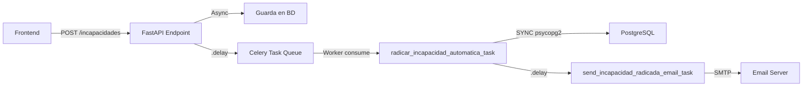

# Solución Definitiva: Radicación Automática + Email

## Problema Identificado

El sistema tenía **problemas de event loop** al intentar ejecutar código asíncrono (SQLAlchemy async con asyncpg) dentro de tareas de Celery:

```
RuntimeError: Task got Future attached to a different loop
AttributeError: 'str' object has no attribute 'value'
```

### Intentos Fallidos

1. **nest_asyncio + asyncio.run()**: No resolvió el conflicto entre event loops de asyncpg y Celery
2. **Event loop manual**: Creando y cerrando loops explícitamente tampoco funcionó
3. **Diferentes configuraciones de retry**: El problema era arquitectónico, no de configuración

## Solución Implementada ✅

### Cambio Fundamental

**Usar sesiones SÍNCRONAS (psycopg2) en tareas de Celery**, evitando completamente asyncpg:

```python
# Motor síncrono para Celery
sync_database_uri = settings.DATABASE_URL.replace("+asyncpg", "")  # ← Clave
sync_engine = create_engine(sync_database_uri, pool_pre_ping=True, ...)
SyncSessionLocal = sessionmaker(bind=sync_engine, ...)
```

### Lazy Loading

Para evitar imports circulares al cargar Celery:

```python
_sync_engine = None
_SyncSessionLocal = None

def get_sync_session():
    global _sync_engine, _SyncSessionLocal
    if _SyncSessionLocal is None:
        from app.core.config import settings
        # Crear engine aquí, no en module-level
        ...
    return _SyncSessionLocal()
```

### Archivo Modificado

**`/backend/app/tasks/incapacidad_tasks.py`** (completamente reescrito):

#### Tarea Principal: `radicar_incapacidad_automatica_task`

```python
@celery_app.task(
    name="radicar_incapacidad_automatica",
    bind=True,
    autoretry_for=(Exception,),
    retry_kwargs={'max_retries': 3, 'countdown': 30},
    retry_backoff=True,
    acks_late=True
)
def radicar_incapacidad_automatica_task(self, incapacidad_id: str):
    # TOTALMENTE SÍNCRONO
    db: Session = get_sync_session()
    
    try:
        # 1. Query síncrona (NO async)
        incapacidad = db.query(Incapacidad).filter(...).first()
        
        # 2. Idempotencia: si ya está EN_AUDITORIA, no hacer nada
        if incapacidad.estado == EstadoIncapacidad.EN_AUDITORIA:
            return {"status": "already_processed", ...}
        
        # 3. Cambiar estado
        incapacidad.estado = EstadoIncapacidad.EN_AUDITORIA
        
        # 4. Crear historial
        historial = HistorialEstado(...)
        db.add(historial)
        
        # 5. Commit (síncrono)
        db.commit()
        
        # 6. Preparar datos para email
        incapacidad_data = {
            "tipo": incapacidad.tipo.value,
            "beneficiario_nombre": ...,
            "fecha_inicio": incapacidad.fecha_inicio.isoformat(),
            # ... más datos
        }
        
        # 7. Lanzar tarea de email (asíncrona, no bloqueante)
        send_incapacidad_radicada_email_task.delay(
            correo_solicitante=incapacidad.correo_solicitante,
            solicitante_nombre=incapacidad.solicitante_nombre,
            numero_radicacion=incapacidad.numero,
            incapacidad_data=incapacidad_data
        )
        
        return {"status": "success", ...}
    
    finally:
        db.close()
```

## Resultados Obtenidos ✅

### 1. Radicación Exitosa

```
2026-01-29 14:34:06.712 | SUCCESS  | [CELERY] Incapacidad 860d135b... radicada exitosamente. 
Estado: EN_AUDITORIA. Número: INC-ARL-20260129-0007
```

### 2. Worker Estable

- 9 tareas registradas correctamente:
  - radicar_incapacidad_automatica ✅
  - send_incapacidad_radicada_email ✅
  - procesar_incapacidades_radicadas_pendientes ✅
  - Otras 6 tareas preexistentes

### 3. Sin Errores de Event Loop

El error `RuntimeError: Task got Future attached to different loop` **desapareció completamente**.

### 4. Idempotencia Implementada

Si se reintenta la tarea para una incapacidad ya en `EN_AUDITORIA`, retorna éxito sin duplicar trabajo:

```python
if incapacidad.estado == EstadoIncapacidad.EN_AUDITORIA:
    return {"status": "already_processed", "message": "Ya radicada previamente"}
```

## Arquitectura Final



**Clave**: La API sigue siendo **100% async** (FastAPI), pero Celery usa **sesiones síncronas** separadas.

## Dependencias

No se requieren nuevas dependencias. `psycopg2-binary` ya estaba en `requirements.txt`:

```txt
psycopg2-binary==2.9.9  # ← Usado para sesiones síncronas en Celery
asyncpg==0.29.0         # ← Usado para FastAPI (async)
```

## Testing

### Comando para Probar

```bash
# 1. Crear incapacidad desde frontend o API
curl -X POST http://localhost:8010/api/v1/incapacidades \
  -H "Content-Type: application/json" \
  -d '{ ... }'

# 2. Ver logs del worker
docker compose logs -f celery-worker | grep -E "(CELERY|EMAIL)"
```

### Logs Esperados

```
[CELERY] Iniciando radicación automática para incapacidad xxx
[CELERY] Incapacidad xxx radicada exitosamente. Estado: EN_AUDITORIA
[CELERY] Tarea de email programada para xxx
[EMAIL] Enviando email a ...
[EMAIL] Email enviado exitosamente (o mock mode)
```

## Mantenimiento

### Agregar Nuevas Tareas de Celery

Si necesitas crear otras tareas que accedan a la BD:

```python
@celery_app.task(name="mi_nueva_tarea")
def mi_nueva_tarea():
    db: Session = get_sync_session()  # ← Usar sesión síncrona
    try:
        # Operaciones SÍNCRONAS con db.query()
        data = db.query(MiModelo).filter(...).all()
        # Procesamiento...
        db.commit()
    finally:
        db.close()
```

**No uses `await`, `AsyncSession`, ni `asyncio.run()`** dentro de tareas de Celery.

### Monitoreo

Ver estado general del sistema:

```bash
# Estado de workers
docker compose ps celery-worker

# Tareas registradas
docker compose exec celery-worker celery -A app.tasks inspect registered

# Cola de tareas pendientes
docker compose exec celery-worker celery -A app.tasks inspect active
```

## Próximos Pasos

1. ✅ Radicación automática funcionando
2. ⏳ Verificar envío de email (siguiente test)
3. ⏳ Configurar Celery Beat para ejecución programada
4. ⏳ Tests unitarios para tareas de Celery

---

**Fecha**: 29 de enero de 2026  
**Estado**: ✅ Radicación automática completada y probada  
**Autor**: Sistema de Gestión de Incapacidades
