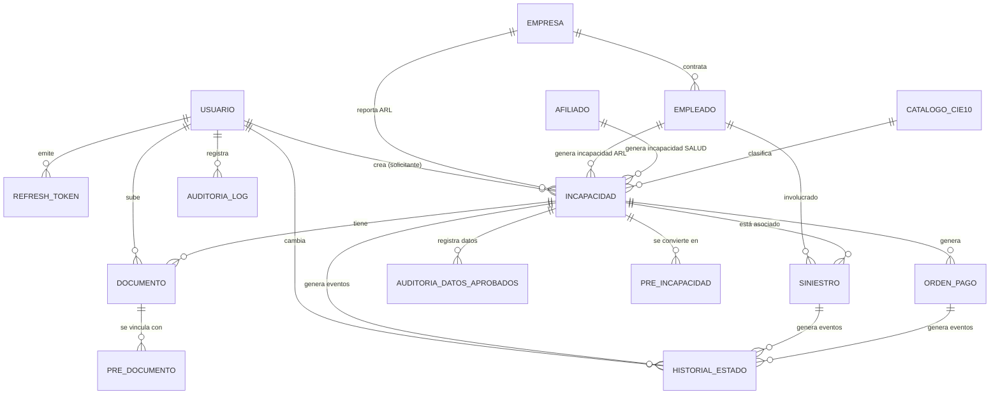

# MODELO DE DATOS

**Versión**: 1.0  
**Última Actualización**: Junio 2026  
**Propósito**: Documentación completa del esquema de base de datos

---

## 1. RESUMEN EJECUTIVO

El modelo de datos consta de **16 tablas principales** organizadas en 4 dominios:

- **Autenticación & Autorización**: `usuario`, `refresh_token`
- **Gestión Empresarial**: `empresa`, `empleado`, `afiliado`
- **Incapacidades & Trazabilidad**: `incapacidad`, `siniestro`, `pre_incapacidad`, `historial_estado`
- **Documentos & Auditoría**: `documento`, `pre_documento`, `auditoria_datos_aprobados`, `auditoria_log`
- **Gestión Financiera**: `orden_pago`
- **Catálogos**: `catalogo_cie10`

**Principios de diseño**:
- UUIDs como primary keys (escalabilidad)
- Timestamps automáticos (creado_en, actualizado_en)
- Soft deletes (campo eliminado_en)
- Polimorfismo (historial_estado, incapacidad)
- Auditoría integral (historial_estado, auditoria_log)

---

## 2. DIAGRAMA ENTIDAD-RELACIÓN



---

## 3. TABLAS Y DICCIONARIO COMPLETO

### 3.1 USUARIO

**Propósito**: Almacenar datos de autenticación y autorización

**Tabla**: `usuario`

**Columnas**:

| Campo | Tipo | Nullable | Índice | Descripción |
|-------|------|----------|--------|-------------|
| `id` | UUID | NO | PRIMARY KEY | Identificador único |
| `email` | VARCHAR(255) | NO | UNIQUE | Email único para login |
| `nombre` | VARCHAR(255) | NO | | Nombre completo |
| `password_hash` | VARCHAR(255) | NO | | Hash bcrypt de contraseña (cost: 12) |
| `rol` | ENUM | NO | | Roles: ADMIN, AUDITOR, APROBADOR, EMPRESA, EMPLEADO, READONLY |
| `activo` | BOOLEAN | NO | DEFAULT true | Usuario activo en el sistema |
| `bloqueado` | BOOLEAN | NO | DEFAULT false | Usuario bloqueado por intentos fallidos |
| `intentos_fallidos` | INTEGER | NO | DEFAULT 0 | Contador de intentos fallidos |
| `fecha_bloqueo` | TIMESTAMP | YES | | Cuándo fue bloqueado |
| `ultimo_login` | TIMESTAMP | YES | | Último acceso exitoso |
| `empresa_id` | UUID | YES | FOREIGN KEY | Empresa si rol=EMPRESA |
| `creado_en` | TIMESTAMP | NO | DEFAULT now() | Fecha creación |
| `actualizado_en` | TIMESTAMP | NO | DEFAULT now() | Fecha última actualización |
| `eliminado_en` | TIMESTAMP | YES | | Soft delete |

**Constraints**:
- PRIMARY KEY: `id`
- UNIQUE: `email`, `email` (donde eliminado_en IS NULL)
- FOREIGN KEY: `empresa_id` → `empresa.id`

**Índices**:
- `idx_usuario_email` (UNIQUE)
- `idx_usuario_rol`
- `idx_usuario_activo`
- `idx_usuario_bloqueado`

**Ejemplo de fila**:
```json
{
  "id": "550e8400-e29b-41d4-a716-446655440001",
  "email": "auditor@aseguradora.com",
  "nombre": "Carlos López",
  "password_hash": "$2b$12$...",
  "rol": "AUDITOR",
  "activo": true,
  "bloqueado": false,
  "intentos_fallidos": 0,
  "empresa_id": null,
  "creado_en": "2026-01-15T10:30:00Z"
}
```

---

### 3.2 REFRESH_TOKEN

**Propósito**: Almacenar tokens de refresco con revocación

**Tabla**: `refresh_token`

**Columnas**:

| Campo | Tipo | Nullable | Descripción |
|-------|------|----------|-------------|
| `id` | UUID | NO | PRIMARY KEY |
| `usuario_id` | UUID | NO | FOREIGN KEY → usuario.id |
| `token_hash` | VARCHAR(255) | NO | SHA256 hash del token (no guardar en claro) |
| `vencimiento` | TIMESTAMP | NO | Fecha de expiración (7 días) |
| `revocado` | BOOLEAN | NO | DEFAULT false | Si fue revocado manualmente |
| `revocado_en` | TIMESTAMP | YES | Cuándo fue revocado |
| `creado_en` | TIMESTAMP | NO | |
| `eliminado_en` | TIMESTAMP | YES | |

**Constraints**:
- PRIMARY KEY: `id`
- FOREIGN KEY: `usuario_id` → `usuario.id`

**Índices**:
- `idx_refresh_token_usuario_id`
- `idx_refresh_token_vencimiento`

---

### 3.3 EMPRESA

**Propósito**: Registrar empresas ARL y sus datos

**Tabla**: `empresa`

**Columnas**:

| Campo | Tipo | Nullable | Descripción |
|-------|------|----------|-------------|
| `id` | UUID | NO | PRIMARY KEY |
| `nombre` | VARCHAR(255) | NO | Nombre comercial |
| `nit` | VARCHAR(20) | NO | Número de identificación tributaria |
| `razon_social` | VARCHAR(255) | YES | Razón social oficial |
| `direccion` | TEXT | YES | Dirección física |
| `telefono` | VARCHAR(20) | YES | Teléfono de contacto |
| `email` | VARCHAR(255) | YES | Email de contacto |
| `tipo_afiliacion` | VARCHAR(50) | NO | ARL, SALUD, AMBAS |
| `poliza_numero` | VARCHAR(50) | YES | Número de póliza ARL |
| `fecha_inicio_poliza` | DATE | YES | Vigencia inicial |
| `fecha_fin_poliza` | DATE | YES | Vigencia final |
| `sync_source` | VARCHAR(50) | YES | Sistema externo (LARAVEL, SAP, etc) |
| `external_id` | VARCHAR(100) | YES | ID en sistema externo |
| `activa` | BOOLEAN | NO | DEFAULT true |
| `creado_en` | TIMESTAMP | NO | |
| `actualizado_en` | TIMESTAMP | NO | |
| `eliminado_en` | TIMESTAMP | YES | |

**Constraints**:
- PRIMARY KEY: `id`
- UNIQUE: `nit` (donde eliminado_en IS NULL)
- UNIQUE: `sync_source, external_id` (si ambos no null)

**Índices**:
- `idx_empresa_nit`
- `idx_empresa_nombre`
- `idx_empresa_activa`
- `idx_empresa_sync_source`

---

### 3.4 EMPLEADO

**Propósito**: Trabajadores de empresas ARL

**Tabla**: `empleado`

**Columnas**:

| Campo | Tipo | Nullable | Descripción |
|-------|------|----------|-------------|
| `id` | UUID | NO | PRIMARY KEY |
| `empresa_id` | UUID | NO | FOREIGN KEY → empresa.id |
| `nombre` | VARCHAR(255) | NO | Nombre completo |
| `documento` | VARCHAR(20) | NO | Documento de identidad |
| `tipo_documento` | VARCHAR(20) | NO | CC, CE, NIT, PASAPORTE |
| `email` | VARCHAR(255) | YES | Email del empleado |
| `telefono` | VARCHAR(20) | YES | Teléfono |
| `cargo` | VARCHAR(100) | NO | Puesto de trabajo |
| `departamento` | VARCHAR(100) | YES | Área/Departamento |
| `salario` | NUMERIC(15,2) | YES | Salario mensual |
| `tipo_contrato` | VARCHAR(50) | YES | INDEFINIDO, FIJO, TEMPORAL, PRAT |
| `fecha_inicio_contrato` | DATE | YES | |
| `fecha_fin_contrato` | DATE | YES | |
| `activo` | BOOLEAN | NO | DEFAULT true |
| `sync_source` | VARCHAR(50) | YES | Sistema externo |
| `external_id` | VARCHAR(100) | YES | ID externo |
| `creado_en` | TIMESTAMP | NO | |
| `actualizado_en` | TIMESTAMP | NO | |
| `eliminado_en` | TIMESTAMP | YES | |

**Constraints**:
- PRIMARY KEY: `id`
- FOREIGN KEY: `empresa_id` → `empresa.id`
- UNIQUE: `empresa_id, documento` (donde eliminado_en IS NULL)

**Índices**:
- `idx_empleado_empresa_id`
- `idx_empleado_documento`
- `idx_empleado_nombre`
- `idx_empleado_activo`

---

### 3.5 AFILIADO

**Propósito**: Personas afiliadas a pólizas de salud

**Tabla**: `afiliado`

**Columnas**:

| Campo | Tipo | Nullable | Descripción |
|-------|------|----------|-------------|
| `id` | UUID | NO | PRIMARY KEY |
| `nombre` | VARCHAR(255) | NO | Nombre completo |
| `documento` | VARCHAR(20) | NO | Documento de identidad |
| `tipo_documento` | VARCHAR(20) | NO | CC, CE, PASAPORTE |
| `email` | VARCHAR(255) | YES | |
| `telefono` | VARCHAR(20) | YES | |
| `fecha_nacimiento` | DATE | YES | |
| `genero` | VARCHAR(20) | YES | M, F, OTRO |
| `poliza_numero` | VARCHAR(50) | NO | Número de póliza salud |
| `eps` | VARCHAR(100) | YES | Entidad prestadora de salud |
| `ips` | VARCHAR(100) | YES | Institución prestadora de servicios |
| `tipo_afiliado` | VARCHAR(50) | NO | TITULAR, BENEFICIARIO, PENSIONADO |
| `fecha_afiliacion` | DATE | YES | |
| `activo` | BOOLEAN | NO | DEFAULT true |
| `sync_source` | VARCHAR(50) | YES | |
| `external_id` | VARCHAR(100) | YES | |
| `creado_en` | TIMESTAMP | NO | |
| `actualizado_en` | TIMESTAMP | NO | |
| `eliminado_en` | TIMESTAMP | YES | |

**Constraints**:
- PRIMARY KEY: `id`
- UNIQUE: `poliza_numero, documento`

**Índices**:
- `idx_afiliado_documento`
- `idx_afiliado_poliza_numero`
- `idx_afiliado_eps`
- `idx_afiliado_activo`

---

### 3.6 INCAPACIDAD (Tabla Polimórfica)

**Propósito**: Núcleo del sistema — Incapacidades ARL y SALUD

**Tabla**: `incapacidad`

**Columnas**:

| Campo | Tipo | Nullable | Descripción |
|-------|------|----------|-------------|
| `id` | UUID | NO | PRIMARY KEY |
| `numero` | VARCHAR(50) | NO | Radicado único (AAAAMMNNNNNN) |
| `tipo` | ENUM | NO | ARL o SALUD |
| `subtipo` | VARCHAR(50) | YES | ACCIDENTE_TRABAJO, ENFERMEDAD_LABORAL, etc |
| `estado` | ENUM | NO | RADICADA, EN_AUDITORIA, APROBADA, EN_PAGO, PAGADA, RECHAZADA, CANCELADA |
| `prioridad` | ENUM | YES | BAJA, MEDIA, ALTA |
| **Relaciones ARL** | | | |
| `empleado_id` | UUID | YES | FOREIGN KEY → empleado.id (si tipo=ARL) |
| `empresa_id` | UUID | YES | FOREIGN KEY → empresa.id (si tipo=ARL) |
| `siniestro_id` | UUID | YES | FOREIGN KEY → siniestro.id (si aplica) |
| `numero_siniestro` | VARCHAR(50) | YES | Referencia siniestro externo |
| **Relaciones SALUD** | | | |
| `afiliado_id` | UUID | YES | FOREIGN KEY → afiliado.id (si tipo=SALUD) |
| **Solicitante** | | | |
| `solicitante_id` | UUID | YES | FOREIGN KEY → solicitante.id |
| **Fechas de Incapacidad** | | | |
| `fecha_inicio` | DATE | NO | Primer día de incapacidad |
| `fecha_fin` | DATE | NO | Último día de incapacidad |
| `dias_totales` | INTEGER | NO | Calculado: fecha_fin - fecha_inicio + 1 |
| **Diagnóstico** | | | |
| `diagnostico_cie10` | VARCHAR(10) | YES | Código CIE-10 (ej: M79.3) |
| `descripcion_diagnostico` | TEXT | YES | Descripción libre |
| **Médico Tratante** | | | |
| `nombre_medico` | VARCHAR(200) | YES | Nombre del médico |
| `registro_medico` | VARCHAR(50) | YES | Número de registro profesional |
| `eps_medica` | VARCHAR(255) | YES | EPS del médico |
| **Valores** | | | |
| `valor_dia` | NUMERIC(15,2) | YES | Salario diario o base cálculo |
| `valor_total` | NUMERIC(15,2) | YES | Valor total (días × valor_dia) |
| **Auditoría** | | | |
| `observaciones_auditoria` | TEXT | YES | Notas del auditor |
| `creado_en` | TIMESTAMP | NO | |
| `actualizado_en` | TIMESTAMP | NO | |
| `eliminado_en` | TIMESTAMP | YES | |

**Constraints**:
- PRIMARY KEY: `id`
- UNIQUE: `numero`
- CHECK: `(tipo='ARL' AND empleado_id IS NOT NULL AND empresa_id IS NOT NULL AND afiliado_id IS NULL) OR (tipo='SALUD' AND afiliado_id IS NOT NULL AND empleado_id IS NULL AND empresa_id IS NULL)`

**Índices**:
- `idx_incapacidad_numero` (UNIQUE)
- `idx_incapacidad_estado`
- `idx_incapacidad_tipo`
- `idx_incapacidad_empleado_id`
- `idx_incapacidad_empresa_id`
- `idx_incapacidad_afiliado_id`
- `idx_incapacidad_fecha_inicio`
- `idx_incapacidad_fecha_fin`
- `idx_incapacidad_creado_en`

---

### 3.7 SINIESTRO

**Propósito**: Accidentes/eventos laborales ARL

**Tabla**: `siniestro`

**Columnas**:

| Campo | Tipo | Nullable | Descripción |
|-------|------|----------|-------------|
| `id` | UUID | NO | PRIMARY KEY |
| `numero_siniestro` | VARCHAR(50) | NO | Número único del siniestro |
| `empresa_id` | UUID | NO | FOREIGN KEY → empresa.id |
| `empleado_id` | UUID | NO | FOREIGN KEY → empleado.id |
| `tipo_evento` | VARCHAR(100) | YES | ACCIDENTE_TRABAJO, ACCIDENTE_TRAYECTO, ENFERMEDAD_LABORAL |
| `fecha_evento` | DATE | NO | Cuándo ocurrió el evento |
| `descripcion_evento` | TEXT | YES | Descripción detallada |
| `lugar_evento` | VARCHAR(255) | YES | Dónde sucedió |
| `testigos` | TEXT | YES | Nombres de testigos |
| `estado` | ENUM | NO | RADICADO, EN_INVESTIGACION, CERRADO |
| `investigador` | VARCHAR(255) | YES | Responsable de investigación |
| `creado_en` | TIMESTAMP | NO | |
| `actualizado_en` | TIMESTAMP | NO | |
| `eliminado_en` | TIMESTAMP | YES | |

**Constraints**:
- PRIMARY KEY: `id`
- UNIQUE: `numero_siniestro`
- FOREIGN KEY: `empresa_id` → `empresa.id`
- FOREIGN KEY: `empleado_id` → `empleado.id`

**Índices**:
- `idx_siniestro_numero_siniestro`
- `idx_siniestro_empresa_id`
- `idx_siniestro_empleado_id`
- `idx_siniestro_estado`
- `idx_siniestro_fecha_evento`

---

### 3.8 DOCUMENTO

**Propósito**: Archivos adjuntos a incapacidades

**Tabla**: `documento`

**Columnas**:

| Campo | Tipo | Nullable | Descripción |
|-------|------|----------|-------------|
| `id` | UUID | NO | PRIMARY KEY |
| `incapacidad_id` | UUID | YES | FOREIGN KEY → incapacidad.id (opcional) |
| `pre_incapacidad_id` | UUID | YES | FOREIGN KEY → pre_incapacidad.id (pre-radicación) |
| `nombre_original` | VARCHAR(255) | NO | Nombre archivo original |
| `nombre_almacenado` | VARCHAR(255) | NO | Nombre guardado (sanitizado) |
| `tipo` | VARCHAR(100) | NO | CERTIFICADO_MEDICO, SINIESTRO, FOTOCOPIAS, ORDEN_MEDICA, OTRO |
| `extension` | VARCHAR(10) | NO | pdf, jpg, png, etc |
| `tamanio` | INTEGER | NO | Bytes |
| `ruta` | VARCHAR(500) | NO | Ruta en almacenamiento (MinIO o filesystem) |
| `url_publica` | VARCHAR(500) | YES | URL descargable (signed URL) |
| `hash_md5` | VARCHAR(32) | YES | Hash MD5 para verificación |
| `hash_sha256` | VARCHAR(64) | YES | Hash SHA256 para verificación |
| `storage_type` | VARCHAR(50) | NO | MINIO o FILESYSTEM |
| `subido_por_id` | UUID | YES | FOREIGN KEY → usuario.id |
| `descripcion` | TEXT | YES | Descripción del documento |
| `creado_en` | TIMESTAMP | NO | |
| `actualizado_en` | TIMESTAMP | NO | |
| `eliminado_en` | TIMESTAMP | YES | |

**Constraints**:
- PRIMARY KEY: `id`
- FOREIGN KEY: `incapacidad_id` → `incapacidad.id`
- FOREIGN KEY: `pre_incapacidad_id` → `pre_incapacidad.id`
- FOREIGN KEY: `subido_por_id` → `usuario.id`

**Índices**:
- `idx_documento_incapacidad_id`
- `idx_documento_pre_incapacidad_id`
- `idx_documento_tipo`
- `idx_documento_creado_en`

---

### 3.9 PRE_INCAPACIDAD

**Propósito**: Radicaciones en borrador antes de ser enviadas

**Tabla**: `pre_incapacidad`

**Columnas**:

| Campo | Tipo | Nullable | Descripción |
|-------|------|----------|-------------|
| `id` | UUID | NO | PRIMARY KEY |
| `tipo` | ENUM | NO | ARL o SALUD |
| `empleado_id` | UUID | YES | Para ARL |
| `empresa_id` | UUID | YES | Para ARL |
| `afiliado_id` | UUID | YES | Para SALUD |
| `solicitante_id` | UUID | YES | Quién está rellenando |
| `estado` | VARCHAR(50) | NO | BORRADOR, COMPLETA, LISTA_ENVIO |
| `datos_formulario` | JSONB | NO | Datos capturados en forma |
| `paso_completado` | INTEGER | YES | Último paso rellenado (0-5) |
| `creado_en` | TIMESTAMP | NO | |
| `actualizado_en` | TIMESTAMP | NO | |
| `vencimiento` | TIMESTAMP | NO | Expira si no se completa (30 días) |

**Propósito**: Permite guardar progreso antes de radicación final

---

### 3.10 PRE_DOCUMENTO

**Propósito**: Documentos subidos durante pre-radicación

**Tabla**: `pre_documento`

**Columnas**: Similar a DOCUMENTO pero vinculado con `pre_incapacidad_id`

---

### 3.11 AUDITORIA_DATOS_APROBADOS

**Propósito**: Captura datos aprobados al auditar incapacidad

**Tabla**: `auditoria_datos_aprobados`

**Columnas**:

| Campo | Tipo | Nullable | Descripción |
|-------|------|----------|-------------|
| `id` | UUID | NO | PRIMARY KEY |
| `incapacidad_id` | UUID | NO | FOREIGN KEY → incapacidad.id |
| `datos_aprobados` | JSONB | NO | {nombre, documento, valor_aprobado, dias_aprobados, observaciones} |
| `aprobado_por_id` | UUID | YES | FOREIGN KEY → usuario.id |
| `aprobado_en` | TIMESTAMP | NO | |
| `creado_en` | TIMESTAMP | NO | |

**Ejemplo JSONB**:
```json
{
  "nombre_beneficiario": "Juan Pérez",
  "documento_beneficiario": "1234567890",
  "valor_aprobado": 750000.00,
  "dias_aprobados": 15,
  "fecha_aprobacion": "2026-06-03T14:00:00Z",
  "observaciones": "Aprobado con valor íntegro"
}
```

---

### 3.12 AUDITORIA_LOG

**Propósito**: Log de todas las acciones administrativas y cambios sensibles

**Tabla**: `auditoria_log`

**Columnas**:

| Campo | Tipo | Nullable | Descripción |
|-------|------|----------|-------------|
| `id` | UUID | NO | PRIMARY KEY |
| `usuario_id` | UUID | YES | FOREIGN KEY → usuario.id |
| `accion` | VARCHAR(100) | NO | LOGIN, LOGOUT, CREATE, UPDATE, DELETE, APPROVE, REJECT |
| `entidad_tipo` | VARCHAR(100) | NO | Qué cambió: INCAPACIDAD, ORDEN_PAGO, USUARIO, etc |
| `entidad_id` | UUID | YES | ID de la entidad |
| `cambios_antes` | JSONB | YES | Estado anterior |
| `cambios_despues` | JSONB | YES | Estado nuevo |
| `ip_origen` | VARCHAR(50) | YES | IP de quién lo hizo |
| `user_agent` | TEXT | YES | Navegador/cliente |
| `creado_en` | TIMESTAMP | NO | |

**Ejemplo**:
```json
{
  "accion": "APPROVE",
  "entidad_tipo": "INCAPACIDAD",
  "entidad_id": "550e8400-...",
  "cambios_antes": {"estado": "EN_AUDITORIA"},
  "cambios_despues": {"estado": "APROBADA"},
  "usuario_id": "550e8400-...",
  "ip_origen": "192.168.1.100",
  "creado_en": "2026-06-03T14:00:00Z"
}
```

**Índices**:
- `idx_auditoria_log_usuario_id`
- `idx_auditoria_log_accion`
- `idx_auditoria_log_entidad_tipo`
- `idx_auditoria_log_creado_en`

---

### 3.13 HISTORIAL_ESTADO (Tabla Polimórfica)

**Propósito**: Auditoría de cambios de estado para múltiples entidades

**Tabla**: `historial_estado`

**Columnas**:

| Campo | Tipo | Nullable | Descripción |
|-------|------|----------|-------------|
| `id` | UUID | NO | PRIMARY KEY |
| `entidad_tipo` | VARCHAR(50) | NO | INCAPACIDAD, ORDEN_PAGO, SINIESTRO |
| `entidad_id` | UUID | NO | ID de la entidad que cambió |
| `estado_anterior` | VARCHAR(50) | YES | Estado previo |
| `estado_nuevo` | VARCHAR(50) | NO | Nuevo estado |
| `razon` | TEXT | YES | Por qué cambió |
| `observaciones` | TEXT | YES | Notas adicionales |
| `cambiado_por_id` | UUID | YES | FOREIGN KEY → usuario.id |
| `creado_en` | TIMESTAMP | NO | |

**Constraints**:
- PRIMARY KEY: `id`
- CHECK: `entidad_tipo IN ('INCAPACIDAD', 'ORDEN_PAGO', 'SINIESTRO')`

**Índices**:
- `idx_historial_estado_entidad` (entidad_tipo, entidad_id)
- `idx_historial_estado_creado_en`
- Composite: `(entidad_tipo, entidad_id, creado_en DESC)` para "latest first"

---

### 3.14 ORDEN_PAGO

**Propósito**: Órdenes de pago para incapacidades aprobadas

**Tabla**: `orden_pago`

**Columnas**:

| Campo | Tipo | Nullable | Descripción |
|-------|------|----------|-------------|
| `id` | UUID | NO | PRIMARY KEY |
| `numero_orden` | VARCHAR(50) | NO | Número único (OP-YYYY-NNNNN) |
| `incapacidad_id` | UUID | NO | FOREIGN KEY → incapacidad.id |
| `estado` | ENUM | NO | GENERADA, APROBADA, EN_PROCESO, PAGADA, ANULADA |
| `monto_total` | NUMERIC(15,2) | NO | |
| `monto_neto` | NUMERIC(15,2) | YES | Después de descuentos |
| `impuestos_retenidos` | NUMERIC(15,2) | YES | |
| `detalles_descuentos` | JSONB | YES | [{concepto, valor}] |
| `metodo_pago` | VARCHAR(50) | YES | TRANSFERENCIA_BANCARIA, EFECTIVO, CHEQUE |
| `banco_destino` | VARCHAR(100) | YES | |
| `numero_cuenta` | VARCHAR(50) | YES | |
| `numero_comprobante` | VARCHAR(100) | YES | Referencia externa del pago |
| `fecha_pago` | TIMESTAMP | YES | Cuándo se realizó |
| `observaciones` | TEXT | YES | |
| `creado_en` | TIMESTAMP | NO | |
| `actualizado_en` | TIMESTAMP | NO | |
| `eliminado_en` | TIMESTAMP | YES | |

**Constraints**:
- PRIMARY KEY: `id`
- UNIQUE: `numero_orden`
- FOREIGN KEY: `incapacidad_id` → `incapacidad.id`

**Índices**:
- `idx_orden_pago_numero_orden`
- `idx_orden_pago_incapacidad_id`
- `idx_orden_pago_estado`
- `idx_orden_pago_fecha_pago`

---

### 3.15 CATALOGO_CIE10

**Propósito**: Clasificación Internacional de Enfermedades (para seleccionadores)

**Tabla**: `catalogo_cie10`

**Columnas**:

| Campo | Tipo | Nullable | Descripción |
|-------|------|----------|-------------|
| `id` | UUID | NO | PRIMARY KEY |
| `codigo` | VARCHAR(10) | NO | Código CIE-10 (ej: M79.3) |
| `descripcion` | TEXT | NO | Descripción en español |
| `capitulo` | VARCHAR(10) | YES | Capítulo CIE (I-XXII) |
| `acti
vo` | BOOLEAN | NO | DEFAULT true |
| `creado_en` | TIMESTAMP | NO | |

**Índices**:
- `idx_catalogo_cie10_codigo` (UNIQUE)
- `idx_catalogo_cie10_descripcion` (FTS5)

---

### 3.16 SOLICITANTE

**Propósito**: Personas que radican incapacidades

**Tabla**: `solicitante`

**Columnas**:

| Campo | Tipo | Nullable | Descripción |
|-------|------|----------|-------------|
| `id` | UUID | NO | PRIMARY KEY |
| `nombre` | VARCHAR(255) | NO | |
| `documento` | VARCHAR(20) | NO | |
| `tipo_documento` | VARCHAR(20) | NO | CC, CE, etc |
| `email` | VARCHAR(255) | YES | |
| `telefono` | VARCHAR(20) | YES | |
| `relacion_incapacidad` | VARCHAR(100) | YES | EMPLEADO, FAMILIAR, GESTOR, TERCERO |
| `creado_en` | TIMESTAMP | NO | |
| `actualizado_en` | TIMESTAMP | NO | |

---

## 4. TIPOS DE DATOS ESPECIALES

### 4.1 ENUMS

```sql
CREATE TYPE tipoincapacidad AS ENUM ('ARL', 'SALUD');
CREATE TYPE estadoincapacidad AS ENUM (
  'RADICADA',
  'EN_AUDITORIA',
  'OBSERVADA',
  'APROBADA',
  'APROBADA_PARCIALMENTE',
  'RECHAZADA',
  'EN_PAGO',
  'EN_PAGO_PARCIAL',
  'PAGADA',
  'PAGADA_PARCIALMENTE',
  'CANCELADA'
);
CREATE TYPE estadoorden AS ENUM (
  'GENERADA',
  'APROBADA',
  'EN_PROCESO',
  'PAGADA',
  'ANULADA'
);
CREATE TYPE rol AS ENUM (
  'ADMIN',
  'AUDITOR',
  'APROBADOR',
  'EMPRESA',
  'EMPLEADO',
  'READONLY'
);
```

### 4.2 JSONB Fields

- `incapacidad.observaciones_auditoria` → Array de observaciones
- `auditoria_datos_aprobados.datos_aprobados` → Snapshot de datos
- `orden_pago.detalles_descuentos` → Array de descuentos
- `pre_incapacidad.datos_formulario` → Formulario en progreso
- `auditoria_log.cambios_antes/despues` → Diff de cambios

---

## 5. VISTAS MATERIALIZADAS (para reporting)

```sql
-- Vista de Incapacidades por Estado
CREATE MATERIALIZED VIEW mv_incapacidades_por_estado AS
SELECT
  estado,
  COUNT(*) as total,
  SUM(valor_total) as valor_total,
  AVG(dias_totales) as dias_promedio
FROM incapacidad
WHERE eliminado_en IS NULL
GROUP BY estado;

-- Vista de Pagos por Mes
CREATE MATERIALIZED VIEW mv_pagos_por_mes AS
SELECT
  DATE_TRUNC('month', fecha_pago) as mes,
  COUNT(*) as total_pagos,
  SUM(monto_neto) as monto_total
FROM orden_pago
WHERE estado = 'PAGADA' AND eliminado_en IS NULL
GROUP BY DATE_TRUNC('month', fecha_pago);

-- Índice en vistas para búsqueda rápida
CREATE INDEX idx_mv_incapacidades_estado ON mv_incapacidades_por_estado (estado);
```

---

## 6. TRIGGERS

### 6.1 Trigger: Generar Historial al Cambiar Estado

```sql
CREATE TRIGGER tr_incapacidad_estado
AFTER UPDATE OF estado ON incapacidad
FOR EACH ROW
WHEN (OLD.estado IS DISTINCT FROM NEW.estado)
EXECUTE FUNCTION fn_registrar_cambio_estado();

-- Función
CREATE FUNCTION fn_registrar_cambio_estado()
RETURNS TRIGGER AS $$
BEGIN
  INSERT INTO historial_estado (
    entidad_tipo, entidad_id, estado_anterior, estado_nuevo,
    razon, cambiado_por_id, creado_en
  ) VALUES (
    'INCAPACIDAD', NEW.id, OLD.estado, NEW.estado,
    'Cambio de estado automático', NULL, NOW()
  );
  RETURN NEW;
END;
$$ LANGUAGE plpgsql;
```

### 6.2 Trigger: Actualizar Timestamp

```sql
CREATE TRIGGER tr_actualizado_en
BEFORE UPDATE ON incapacidad
FOR EACH ROW
EXECUTE FUNCTION fn_actualizar_timestamp();

CREATE FUNCTION fn_actualizar_timestamp()
RETURNS TRIGGER AS $$
BEGIN
  NEW.actualizado_en = NOW();
  RETURN NEW;
END;
$$ LANGUAGE plpgsql;
```

---

## 7. POLÍTICAS DE INDEXACIÓN

**Estrategia de índices por tabla**:

| Tabla | Índices Críticos |
|-------|-----------------|
| **usuario** | email (UNIQUE), rol, activo, bloqueado |
| **incapacidad** | numero (UNIQUE), estado, tipo, empleado_id, empresa_id, fecha_inicio, fecha_fin |
| **documento** | incapacidad_id, tipo, creado_en |
| **historial_estado** | (entidad_tipo, entidad_id, creado_en DESC) — composite |
| **orden_pago** | numero_orden (UNIQUE), incapacidad_id, estado |
| **empresa** | nit (UNIQUE), nombre |
| **empleado** | (empresa_id, documento) — composite |
| **afiliado** | documento, poliza_numero, eps |

---

## 8. RELACIONES Y CARDINALIDADES

```
USUARIO 1──N REFRESH_TOKEN
USUARIO 1──N AUDITORIA_LOG
USUARIO 1──N HISTORIAL_ESTADO (cambiado_por)

EMPRESA 1──N EMPLEADO
EMPRESA 1──N SINIESTRO
EMPRESA 1──N INCAPACIDAD (tipo=ARL)

EMPLEADO 1──N INCAPACIDAD (tipo=ARL)
EMPLEADO 1──N SINIESTRO

AFILIADO 1──N INCAPACIDAD (tipo=SALUD)

INCAPACIDAD 1──N DOCUMENTO
INCAPACIDAD 1──N ORDEN_PAGO
INCAPACIDAD 1──N HISTORIAL_ESTADO
INCAPACIDAD 1──N AUDITORIA_DATOS_APROBADOS

SINIESTRO 1──N INCAPACIDAD
SINIESTRO 1──N HISTORIAL_ESTADO

ORDEN_PAGO 1──N HISTORIAL_ESTADO
```

---

## 9. REFERENCIA DE TIPOS DE DATOS POSTGRESQL

| Tipo | Rango | Uso |
|------|-------|-----|
| `UUID` | 128-bit | Primary keys, identifiers |
| `VARCHAR(n)` | 1-1GB | Strings con límite |
| `TEXT` | 1-1GB | Strings sin límite |
| `INTEGER` | -2^31 a 2^31-1 | Números enteros |
| `NUMERIC(15,2)` | Precisión arbitraria | Dinero, cálculos exactos |
| `DATE` | 4712 BC - 5874897 AD | Fechas sin hora |
| `TIMESTAMP` | 1901-01-01 - 2038-01-19 | Fechas + hora |
| `BOOLEAN` | true/false | Flags |
| `ENUM` | Valores predefinidos | Estados, roles |
| `JSONB` | hasta 1GB | Datos semi-estructurados |
| `BYTEA` | hasta 1GB | Datos binarios |

---

**Total de tablas**: 16  
**Total de columnas**: ~250  
**Relaciones One-to-Many**: 35+  
**Restricciones**: 80+  
**Índices**: 100+
