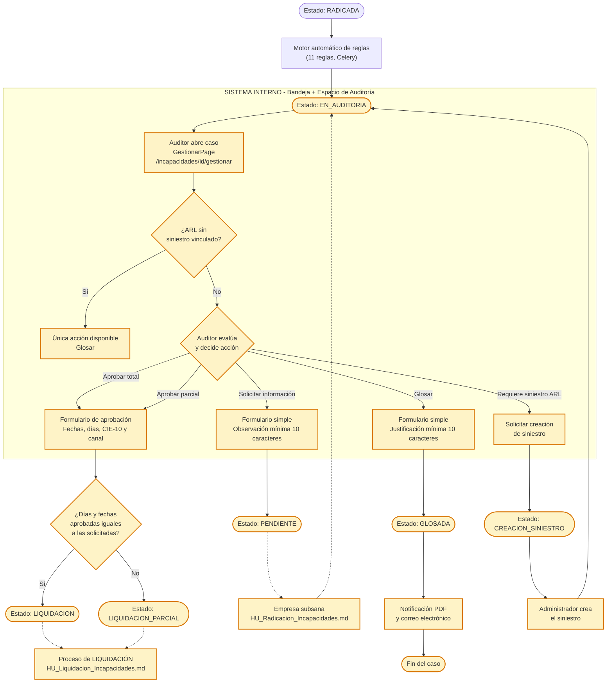

# Levantamiento Funcional — Historias de Usuario

## Módulo de Incapacidades — Proceso: AUDITORÍA

---

## 1. Encabezado del Documento

| Campo | Valor |
|---|---|
| Código de Necesidad/Proyecto | _(diligenciar)_ |
| Nombre Necesidad/Proyecto | Módulo de Incapacidades — Auditoría |
| Área Solicitante | _(diligenciar)_ |
| Usuarios Aprobadores | _(diligenciar)_ |
| Áreas Impactadas | Auditoría médica y administrativa / Siniestros |
| Aplicaciones Impactadas | Sistema-Interno (auditores, coordinadores) — el Portal-Externo participa solo como receptor pasivo de notificaciones |
| Responsable Funcional | _(diligenciar)_ |
| Usuarios Pruebas UAT | _(diligenciar)_ |

> **Nota de alcance**: este documento cubre exclusivamente el proceso de **Auditoría**, que en el código actual ocurre 100% en el **Sistema-Interno** (no existe ninguna pantalla de auditoría en el Portal-Externo). Los procesos de Radicación y Liquidación se documentan en `HU_Radicacion_Incapacidades.md` y `HU_Liquidacion_Incapacidades.md` respectivamente. **No se incluye ninguna historia relacionada con el módulo de "pre-incapacidades"** (deprecado, confirmado por el área funcional), incluyendo su panel de inconsistencias y su flujo de promoción — esas capacidades no se retoman ni como base para nuevas historias de auditoría.

---

## 2. Control de Cambio al Documento

| Fecha | Versión | Responsable | Descripción del cambio | Aplicación |
|---|---|---|---|---|
| 2026-07-16 | 1.0 | Analista Funcional (Claude Code) | Creación del documento a partir de levantamiento de código fuente (backend, sistema-interno) | Sistema-Interno |

---

## 3. Diagrama de Proceso / Hito TO-BE



**Compuertas de decisión relevantes al tramo de Auditoría**:
- **B2**: una incapacidad ARL sin siniestro vinculado solo permite la acción "Glosar" — bloqueo duro en la interfaz.
- **B4**: decisión central del auditor entre 4 acciones (Aprobar / Aprobar parcial / Pendiente / Glosar) más la solicitud de creación de siniestro.
- **D1**: el sistema determina automáticamente si el resultado es `LIQUIDACION` (aprobación total, sin cambios en fechas/días) o `LIQUIDACION_PARCIAL` (cualquier cambio en fechas/días aprobados vs. solicitados) — el auditor no elige manualmente entre ambos estados, el sistema los infiere.

---

## 4. Detalle Situación Actual de la Aplicación

### SISTEMA-INTERNO

1. **Motor automático de reglas** (`auditoria_service.py`): al pasar una incapacidad de `RADICADA` a `EN_AUDITORIA`, un job asíncrono evalúa 11 reglas predefinidas y persiste un resultado (cumple/no cumple) por cada una, sin intervención humana. Estas reglas son de **validación técnica** (campos vacíos, consistencia de fechas/días, plazos), no de pertinencia médica.
2. **Espacio de trabajo de gestión** (`GestionarPage`, `/incapacidades/{id}/gestionar`): pantalla dividida — panel izquierdo con visor de documentos colapsable, panel derecho con pestañas "Auditoría" (acción del auditor), "Validaciones" (resultado de las 11 reglas + otras inconsistencias) e "Historial" (línea de tiempo de cambios de estado). Solo permite gestión activa cuando el estado es `RADICADA`, `EN_AUDITORIA` o `PENDIENTE`.
3. **AuditoriaPanel**: componente central de decisión del auditor con 4 acciones posibles (Aprobar para pago, Liquidación Parcial, Pendiente, Glosar), o solo "Glosar" si es una incapacidad ARL sin siniestro vinculado. El formulario de aprobación permite ajustar fechas/días aprobados, buscar y confirmar el CIE-10 (con autocompletado desde catálogo), canal de recepción, IPS y médico, y genera un "texto copiable" pensado para pegarse en el sistema externo "Arpis".
4. **Determinación automática de LIQUIDACION vs. LIQUIDACION_PARCIAL**: el backend compara las fechas/días aprobados contra los solicitados originalmente; si son iguales, el destino es `LIQUIDACION` (aprobación total); si hay cualquier diferencia, es `LIQUIDACION_PARCIAL`. El auditor no elige el estado destino directamente.
5. **Glosa**: al rechazar (`Glosar`), el sistema genera automáticamente una carta en PDF y la envía por correo a la empresa; existe un botón de reenvío manual de esa notificación para los casos en que el auditor necesite reenviarla.
6. **Vinculación de siniestro**: para incapacidades ARL sin siniestro asociado, el auditor puede buscar siniestros candidatos del mismo empleado y vincularlos, o solicitar la creación de un siniestro nuevo (flujo que pasa por un rol ADMIN).
7. **Panel de éxito persistente**: tras una acción de aprobación, el resultado (nuevo estado + texto copiable) permanece visible en pantalla incluso después de que la incapacidad deja de ser gestionable (corrección reciente confirmada en el historial de commits del proyecto).
8. **Consulta general** (`ConsultaPage`): búsqueda de incapacidades en cualquier estado, con exportación a CSV, para fines de seguimiento y control.
9. **Auditoría médica vs. administrativa**: el código actual **no distingue** entre revisión de pertinencia médica y revisión administrativa/documental — es un único flujo de decisión con un solo campo de observación libre, ejecutado por el rol genérico AUDITOR (no existe un rol AUDITOR_MEDICO).

---

## 5. Funcionalidades Impactadas

| Aplicación | Funcionalidad | EXISTENTE (ruta código/menú) | NUEVA (ruta donde se requiere) |
|---|---|---|---|
| Sistema-Interno | Motor automático de reglas de auditoría | `app/services/auditoria_service.py` | — |
| Sistema-Interno | Espacio de trabajo de gestión/auditoría | `src/pages/incapacidades/GestionarPage.tsx` | — |
| Sistema-Interno | Aprobar incapacidad para pago | `AuditoriaPanel.tsx` → `POST /incapacidades/{id}/aprobar-en-auditoria` | — |
| Sistema-Interno | Aprobar liquidación parcial | Mismo componente/endpoint que aprobación total | — |
| Sistema-Interno | Solicitar información adicional (PENDIENTE) | `AuditoriaPanel.tsx` → `POST /incapacidades/{id}/auditar` | — |
| Sistema-Interno | Glosar (rechazar) incapacidad | `AuditoriaPanel.tsx` → `POST /incapacidades/{id}/auditar` | — |
| Sistema-Interno | Notificación y reenvío de glosa | `glosada_notification_service.py`, `POST /incapacidades/{id}/reenviar-notificacion-glosada` | — |
| Sistema-Interno | Vinculación de siniestro a incapacidad ARL | `POST /incapacidades/{id}/vincular-siniestro` | — |
| Sistema-Interno | Solicitud y creación de siniestro | `auditar_creacion_siniestro.py`, `creacion_siniestro.py` | — |
| Sistema-Interno | Plantilla de auditoría + texto copiable (Arpis) | `plantilla_auditoria_service.py` | — |
| Sistema-Interno | Panel de validaciones/inconsistencias | `ValidacionesPanel.tsx` | — |
| Sistema-Interno | Consulta general + exportación CSV | `src/pages/incapacidades/ConsultaPage.tsx` | — |
| Sistema-Interno | Historial/trazabilidad de estados | `HistorialTimeline.tsx` | — |
| Sistema-Interno | Diferenciación entre auditoría médica y administrativa | — | Nuevo rol `AUDITOR_MEDICO`/checklist médico separado |
| Sistema-Interno / Portal-Externo | Respuesta de la empresa a una glosa | — | Nueva pantalla en Portal-Externo + endpoint backend |
| Sistema-Interno | Control de acceso granular (`PermissionChecker`) en endpoints críticos de auditoría | `get_current_user` únicamente (sin `PermissionChecker`) en `/auditar`, `/aprobar-en-auditoria`, `/aprobar`, `/rechazar` | Endurecimiento de seguridad sobre los mismos endpoints |

---

## 6. Requerimientos y Criterios de Aceptación por Aplicación

```
APLICACIÓN: SISTEMA-INTERNO / # Requerimiento JIRA: ____________
  → PROCESO: AUDITORÍA
```

### Historia de Usuario 1:
**Evaluación automática de reglas de auditoría**

**Yo Como** sistema, en apoyo al auditor
**Quiero** evaluar automáticamente un conjunto de reglas técnicas apenas una incapacidad entra a auditoría
**Para** que el auditor cuente de inmediato con un diagnóstico objetivo de inconsistencias antes de tomar una decisión

Criterios de aceptación

1. **CA1: Ejecución automática al cambiar de estado**
   Dado que una incapacidad pasa de `RADICADA` a `EN_AUDITORIA`
   Cuando el sistema procesa la transición
   Entonces ejecuta automáticamente las 11 reglas definidas y persiste un resultado (cumple/no cumple) por cada una, sin intervención del auditor

   Regla de negocio:
   - Reglas de tipo `FIELD_VALIDATION`: `EMPTY_EMPLEADO_NUMERO`, `EMPTY_TIPO_ENFERMEDAD`, `EMPTY_DIAGNOSTICO_CIE10`, `EMPTY_NOMBRE_MEDICO`, `EMPTY_REGISTRO_MEDICO`, `INVALID_DATE_RANGE`.
   - Reglas de tipo `BUSINESS_RULE`: `DIAS_TOTALES_MISMATCH` (días totales no coincide con el rango de fechas), `RETROACTIVE_BEYOND_LIMIT` (radicación más de 30 días después del inicio), `DURATION_EXCEEDS_LIMIT` (duración mayor a 180 días), `SINIESTRO_REQUERIDO` (ARL sin siniestro vinculado), `PRIMER_DIA_NO_PAGABLE` (fecha de inicio coincide con la fecha del siniestro).

2. **CA2: Visualización del resultado por el auditor**
   Dado que abro el caso de una incapacidad en el espacio de gestión
   Cuando accedo a la pestaña "Validaciones"
   Entonces veo el listado completo de las 11 reglas evaluadas, agrupadas por categoría, indicando cuáles se cumplieron y cuáles no

3. **CA3: Regla SINIESTRO_REQUERIDO bloquea la aprobación total/parcial**
   Dado que una incapacidad es de tipo ARL y no tiene siniestro vinculado
   Cuando el auditor abre el panel de auditoría
   Entonces el sistema solo le permite la acción "Glosar" (las demás acciones quedan ocultas)

4. **CA4: Regla PRIMER_DIA_NO_PAGABLE fuerza aprobación parcial**
   Dado que la fecha de inicio de la incapacidad ARL coincide exactamente con la fecha del siniestro vinculado
   Cuando el auditor intenta aprobar el período completo
   Entonces el sistema no permite la aprobación total y obliga a una aprobación parcial que excluya ese primer día

   Regla de negocio:
   - Fundamento: el primer día de incapacidad derivada de accidente de trabajo no es pagable por la ARL cuando coincide con la fecha del evento — **[ANEXAR NORMA Y ANEXO TÉCNICO]**.

---

### Historia de Usuario 2:
**Gestión del caso desde la bandeja de auditoría**

**Yo Como** auditor (rol AUDITOR o ADMIN)
**Quiero** abrir el espacio de trabajo de una incapacidad pendiente de auditoría
**Para** revisar su información completa antes de tomar una decisión

Criterios de aceptación

1. **CA1: Acceso al espacio de gestión**
   Dado que tengo un caso en estado `RADICADA`, `EN_AUDITORIA` o `PENDIENTE`
   Cuando presiono "Gestionar" desde cualquier bandeja
   Entonces accedo a `/incapacidades/{id}/gestionar` con visor de documentos, pestañas de Auditoría, Validaciones e Historial

2. **CA2: Visor de documentos**
   Dado que estoy en el espacio de gestión
   Cuando reviso los documentos adjuntos por la empresa
   Entonces puedo visualizarlos en un panel colapsable sin salir de la pantalla de gestión

3. **CA3: Bloqueo de gestión fuera de estados auditables**
   Dado que una incapacidad se encuentra en un estado distinto a `RADICADA`, `EN_AUDITORIA` o `PENDIENTE` (ej. ya está en `LIQUIDACION` o `GLOSADA`)
   Cuando accedo a su espacio de gestión
   Entonces las acciones de auditoría aparecen deshabilitadas con un mensaje indicando que el caso no es gestionable en su estado actual

4. **CA4: Control de acceso por rol**
   Dado que un usuario con `rol=EMPRESA`, `EMPLEADO` o `READONLY` intenta abrir el espacio de gestión
   Cuando la aplicación evalúa la ruta
   Entonces le niega el acceso

   Regla de negocio:
   - Acceso de gestión activa: ADMIN, AUDITOR. READONLY solo puede consultar (`ConsultaPage`), no gestionar.

---

### Historia de Usuario 3:
**Aprobar incapacidad para pago (aprobación total)**

**Yo Como** auditor (rol AUDITOR o ADMIN)
**Quiero** aprobar el período completo de una incapacidad para que continúe a liquidación
**Para** reconocer económicamente el período que cumple todos los requisitos de auditoría

Criterios de aceptación

1. **CA1: Aprobación exitosa sin cambios en fechas/días**
   Dado que estoy revisando un caso en `EN_AUDITORIA` (o `PENDIENTE`) que cumple todas las reglas obligatorias
   Cuando selecciono "Aprobar para pago", confirmo las fechas de inicio/fin (iguales a las solicitadas), completo canal de recepción y observación (mínimo 10 caracteres), y confirmo
   Entonces el sistema transiciona la incapacidad al estado `LIQUIDACION`
   Y me muestra el panel de éxito con el nuevo estado y un texto copiable para el sistema externo Arpis

   Regla de negocio:
   - El sistema determina `LIQUIDACION` automáticamente cuando `fecha_inicio_aprobada`, `fecha_fin_aprobada` y `dias_aprobados` son idénticos a los datos originales de la incapacidad.

2. **CA2: Reglas de auditoría fallidas bloquean la aprobación**
   Dado que la incapacidad tiene al menos una regla de severidad `ERROR` sin cumplir (ej. diagnóstico CIE-10 vacío)
   Cuando intento confirmar la aprobación
   Entonces el sistema rechaza la solicitud y muestra el listado de "Reglas de auditoría fallidas" con su código y descripción
   Y la incapacidad permanece en su estado actual

3. **CA3: Validación de fechas del formulario**
   Dado que estoy diligenciando el formulario de aprobación
   Cuando ingreso una fecha de inicio o fin aprobada posterior a la fecha actual, o una fecha fin anterior a la fecha inicio
   Entonces el sistema muestra el error correspondiente ("No puede ser posterior a hoy" / "La fecha fin no puede ser anterior a la fecha inicio") y no permite continuar

4. **CA4: Observación obligatoria**
   Dado que estoy en el formulario de aprobación
   Cuando intento confirmar sin haber escrito al menos 10 caracteres en el campo de observación
   Entonces el sistema muestra "Mínimo 10 caracteres" y no permite el envío

5. **CA5: Control de acceso por rol**
   Dado que un usuario sin autenticación válida intenta invocar `POST /incapacidades/{id}/aprobar-en-auditoria`
   Cuando la petición llega al backend
   Entonces el sistema la rechaza

   Regla de negocio:
   - **[HALLAZGO — GAP DE SEGURIDAD]**: hoy este endpoint solo exige `get_current_user` (cualquier usuario autenticado), sin validar mediante `PermissionChecker` que el rol sea ADMIN/AUDITOR. Se recomienda endurecer el control de acceso — ver ítem 12 de "Funcionalidades Impactadas".

---

### Historia de Usuario 4:
**Aprobar liquidación parcial**

**Yo Como** auditor (rol AUDITOR o ADMIN)
**Quiero** aprobar solo una parte del período o de los días solicitados en una incapacidad
**Para** reconocer económicamente únicamente el período que efectivamente cumple los requisitos, cuando no aplica el período completo

Criterios de aceptación

1. **CA1: Aprobación parcial por ajuste de fechas**
   Dado que estoy revisando un caso donde solo una parte del período solicitado es procedente
   Cuando ajusto la fecha de inicio y/o fin aprobada a un rango menor al solicitado y confirmo
   Entonces el sistema calcula automáticamente los "días aprobados" y transiciona la incapacidad a `LIQUIDACION_PARCIAL`
   Y muestra el aviso "{N} días aprobados vs {M} días solicitados → se generará liquidación parcial"

2. **CA2: Recalculo automático de días aprobados**
   Dado que modifico la fecha de inicio o fin aprobada
   Cuando el formulario recalcula
   Entonces el campo "Días aprobados" se actualiza automáticamente como un valor de solo lectura (no editable directamente)

3. **CA3: Ajuste del diagnóstico CIE-10 en la aprobación**
   Dado que necesito corregir o precisar el diagnóstico durante la aprobación
   Cuando busco un código en el autocompletar CIE-10 y lo selecciono
   Entonces el campo de descripción del diagnóstico se actualiza automáticamente con la descripción oficial del catálogo

   Regla de negocio:
   - Formato CIE-10: `^[A-Z]\d{2}[0-9X]$`. Si el usuario no busca un nuevo código, la descripción se precarga automáticamente resolviendo el CIE-10 original de la incapacidad contra el catálogo.

4. **CA4: Rechazo por reglas de auditoría fallidas**
   Dado que la aprobación parcial no supera la revalidación completa de reglas de negocio
   Cuando intento confirmar
   Entonces el sistema rechaza la solicitud con el detalle de las reglas fallidas y no cambia el estado

---

### Historia de Usuario 5:
**Solicitar información adicional (estado PENDIENTE)**

**Yo Como** auditor (rol AUDITOR o ADMIN)
**Quiero** devolver un caso solicitando información o correcciones adicionales
**Para** que la empresa complemente lo necesario antes de que yo pueda tomar una decisión definitiva

Criterios de aceptación

1. **CA1: Solicitud exitosa de información**
   Dado que estoy revisando un caso en `EN_AUDITORIA`
   Cuando selecciono "Pendiente", describo la información faltante (mínimo 10 caracteres) y confirmo
   Entonces el sistema transiciona la incapacidad a `PENDIENTE`, registra la fecha de inicio del estado pendiente y guarda mi observación

2. **CA2: Observación visible para la empresa**
   Dado que una incapacidad queda en `PENDIENTE`
   Cuando la empresa consulta el detalle desde el Portal-Externo
   Entonces puede leer textualmente la observación que registré

3. **CA3: Validación de longitud mínima**
   Dado que intento confirmar la acción "Pendiente" con una observación de menos de 10 caracteres
   Cuando el sistema valida el formulario
   Entonces muestra "Mínimo 10 caracteres" y no permite el envío

4. **CA4: Retorno a auditoría tras subsanación**
   Dado que un caso en `PENDIENTE` fue corregido/complementado (ver `HU_Radicacion_Incapacidades.md`, HU-8)
   Cuando la empresa envía la corrección
   Entonces el sistema transiciona la incapacidad de vuelta a `EN_AUDITORIA` y limpia la marca de "pendiente desde"

---

### Historia de Usuario 6:
**Glosar (rechazar) una incapacidad**

**Yo Como** auditor (rol AUDITOR o ADMIN)
**Quiero** rechazar definitivamente una incapacidad que no cumple los requisitos de reconocimiento
**Para** cerrar el caso formalmente y comunicar el motivo a la empresa

Criterios de aceptación

1. **CA1: Glosa exitosa**
   Dado que estoy revisando un caso auditable
   Cuando selecciono "Glosar", justifico las razones (mínimo 10 caracteres) y confirmo
   Entonces el sistema transiciona la incapacidad al estado terminal `GLOSADA` y genera automáticamente una notificación PDF que envía por correo a la empresa

   Regla de negocio:
   - `GLOSADA` es un estado terminal — no admite transiciones posteriores dentro del flujo estándar.
   - RN013 (control de fraude): la ARL/EPS puede suspender el reconocimiento ante indicios de documento alterado, suplantación, duplicidad o información inconsistente — fundamento adicional para glosar.

2. **CA2: Justificación obligatoria**
   Dado que intento confirmar la glosa sin escribir al menos 10 caracteres de justificación
   Cuando el sistema valida el formulario
   Entonces muestra "Mínimo 10 caracteres" y no permite el envío

3. **CA3: Glosa desde cualquier estado auditable, incluso ARL sin siniestro**
   Dado que tengo una incapacidad ARL sin siniestro vinculado
   Cuando accedo al panel de auditoría
   Entonces "Glosar" es la única acción disponible, y puedo ejecutarla siguiendo el mismo flujo de justificación

4. **CA4: Fallo en el envío del correo no bloquea la glosa**
   Dado que el envío del correo de notificación de glosa falla por un problema de conectividad SMTP
   Cuando el sistema procesa la glosa
   Entonces el cambio de estado a `GLOSADA` se confirma de todas formas (mejor esfuerzo), y el documento PDF queda disponible en el expediente para reenvío posterior

---

### Historia de Usuario 7:
**Notificación y reenvío de notificación de glosa**

**Yo Como** auditor o administrador (rol AUDITOR o ADMIN)
**Quiero** reenviar la notificación de glosa a la empresa cuando sea necesario
**Para** asegurar que la empresa reciba efectivamente la comunicación del rechazo

Criterios de aceptación

1. **CA1: Reenvío disponible solo en estado GLOSADA**
   Dado que una incapacidad se encuentra en estado `GLOSADA`
   Cuando accedo a su espacio de gestión
   Entonces veo el botón "Reenviar notificación de glosa"

2. **CA2: Confirmación antes de reenviar**
   Dado que presiono "Reenviar notificación de glosa"
   Cuando se abre el diálogo de confirmación
   Entonces veo el texto "Se enviará nuevamente la notificación de glosa al solicitante. ¿Desea continuar?" con opciones "Cancelar"/"Confirmar"

3. **CA3: Reenvío exitoso**
   Dado que confirmo el reenvío
   Cuando el sistema procesa la solicitud
   Entonces muestra la notificación "Notificación reenviada — La notificación de glosa fue reenviada al solicitante."

4. **CA4: Error en el reenvío**
   Dado que el reenvío falla (ej. error de conectividad SMTP)
   Cuando el sistema procesa la solicitud
   Entonces muestra la notificación "Error al reenviar — No se pudo reenviar la notificación." (o el detalle específico del backend)

5. **CA5: Control de acceso por rol**
   Dado que un usuario con rol distinto a ADMIN o AUDITOR intenta reenviar la notificación
   Cuando la interfaz evalúa el permiso
   Entonces el botón de reenvío no se muestra

   Regla de negocio:
   - Permiso requerido: `INCAPACIDAD_AUDIT` (ADMIN, AUDITOR).

---

### Historia de Usuario 8:
**Vinculación de siniestro a una incapacidad ARL**

**Yo Como** auditor (rol AUDITOR o ADMIN)
**Quiero** vincular una incapacidad ARL a su siniestro correspondiente
**Para** habilitar su aprobación, ya que ninguna incapacidad ARL puede aprobarse sin un siniestro asociado

Criterios de aceptación

1. **CA1: Búsqueda de siniestros candidatos**
   Dado que tengo una incapacidad ARL sin siniestro vinculado
   Cuando el sistema busca candidatos
   Entonces me muestra los siniestros del mismo empleado cuya fecha de siniestro sea igual o anterior a la fecha de fin de la incapacidad

2. **CA2: Vinculación exitosa**
   Dado que selecciono un siniestro candidato válido
   Cuando confirmo la vinculación
   Entonces el sistema asocia el siniestro a la incapacidad y habilita las acciones de aprobación total/parcial que antes estaban bloqueadas

   Regla de negocio:
   - Solo se puede vincular un siniestro del mismo empleado; la incapacidad debe estar en estado `EN_AUDITORIA`.

3. **CA3: Sin siniestros candidatos disponibles**
   Dado que no existe ningún siniestro candidato para el empleado
   Cuando reviso la lista de candidatos
   Entonces el sistema me indica que no hay coincidencias y me ofrece la opción de solicitar la creación de un nuevo siniestro

4. **CA4: Control de acceso por rol**
   Dado que un usuario sin permiso `INCAPACIDAD_AUDIT` intenta vincular un siniestro
   Cuando invoca la acción
   Entonces el sistema la rechaza

---

### Historia de Usuario 9:
**Solicitud y creación de siniestro para incapacidad ARL**

**Yo Como** auditor (solicita) y administrador (crea) — roles AUDITOR y ADMIN
**Quiero** solicitar la creación de un siniestro cuando no existe uno vinculable, y que un administrador lo registre
**Para** poder continuar el trámite de auditoría de la incapacidad ARL

Criterios de aceptación

1. **CA1: Solicitud de creación de siniestro por el auditor**
   Dado que no encuentro un siniestro candidato para una incapacidad ARL
   Cuando el auditor solicita la creación de siniestro
   Entonces el sistema transiciona la incapacidad a `CREACION_SINIESTRO` y la incluye en la bandeja correspondiente

2. **CA2: Creación del siniestro por el administrador**
   Dado que una incapacidad está en `CREACION_SINIESTRO`
   Cuando un usuario ADMIN diligencia número de siniestro, fecha del siniestro, tipo (`ACCIDENTE_TRABAJO`/`ENFERMEDAD_LABORAL`/`ACCIDENTE_TRAYECTO`) y descripción (mínimo 10 caracteres)
   Entonces el sistema crea el siniestro, lo vincula automáticamente a la incapacidad, y la retorna al estado `EN_AUDITORIA`

3. **CA3: Restricción de creación exclusiva de ADMIN**
   Dado que un usuario con rol AUDITOR (no ADMIN) intenta crear directamente un siniestro
   Cuando invoca la acción
   Entonces el sistema la rechaza — solo ADMIN puede ejecutar la creación

4. **CA4: Validación de campos obligatorios**
   Dado que el formulario de creación de siniestro está incompleto o la descripción tiene menos de 10 caracteres
   Cuando intento guardar
   Entonces el sistema muestra los errores correspondientes y no crea el registro

---

### Historia de Usuario 10:
**Plantilla de auditoría y texto copiable para sistema externo (Arpis)**

**Yo Como** auditor (rol AUDITOR o ADMIN)
**Quiero** que el sistema genere automáticamente un texto estructurado con los datos de la aprobación
**Para** copiarlo y pegarlo directamente en el sistema externo Arpis sin tener que redigitar la información

Criterios de aceptación

1. **CA1: Precarga de la plantilla**
   Dado que abro el formulario de aprobación de una incapacidad
   Cuando el sistema carga los datos iniciales
   Entonces precarga la plantilla de auditoría con canal de recepción por defecto "Portal IT", IPS y médico tomados de la incapacidad, y la descripción CIE-10 resuelta desde el catálogo

2. **CA2: Generación del texto copiable tras aprobar**
   Dado que confirmo una aprobación (total o parcial)
   Cuando el sistema completa la transición de estado
   Entonces muestra un bloque de texto preformateado listo para copiar, con un botón "Copiar" que lo envía al portapapeles y cambia su etiqueta a "Copiado" por 2 segundos

3. **CA3: Persistencia de la plantilla por incapacidad**
   Dado que ya existe una plantilla de auditoría guardada para una incapacidad
   Cuando reabro el formulario de aprobación
   Entonces el sistema recupera y muestra la plantilla previamente guardada en lugar de una en blanco

4. **CA4: Control de acceso por rol**
   Dado que un usuario sin rol ADMIN o AUDITOR intenta consultar o modificar la plantilla de auditoría
   Cuando invoca el endpoint correspondiente
   Entonces el sistema la rechaza

---

### Historia de Usuario 11:
**Panel de validaciones e inconsistencias**

**Yo Como** auditor (rol AUDITOR o ADMIN)
**Quiero** ver de forma centralizada todas las inconsistencias detectadas en una incapacidad
**Para** tomar una decisión informada sin tener que revisar manualmente cada dato

Criterios de aceptación

1. **CA1: Listado agrupado por categoría**
   Dado que abro la pestaña "Validaciones" de un caso
   Cuando el sistema carga la información
   Entonces veo las inconsistencias agrupadas por categoría (`FIELD_VALIDATION`, `BUSINESS_RULE`, `FRAUD_ALERT`, `INTEGRATION_CHECK`) y por severidad

2. **CA2: Indicador de alertas de fraude**
   Dado que existe al menos una inconsistencia de categoría `FRAUD_ALERT`
   Cuando visualizo el resumen del caso
   Entonces el sistema resalta visualmente que el caso tiene una alerta de fraude activa

3. **CA3: Sin inconsistencias**
   Dado que una incapacidad no tiene ninguna inconsistencia registrada
   Cuando abro la pestaña de Validaciones
   Entonces el sistema muestra un estado vacío indicando que no hay hallazgos

4. **CA4: Detalle de cada inconsistencia**
   Dado que expando una inconsistencia del listado
   Cuando el panel se despliega
   Entonces veo el valor encontrado y el valor esperado que originaron la alerta

---

### Historia de Usuario 12:
**Consulta general de incapacidades y exportación**

**Yo Como** auditor, aprobador o usuario de solo lectura (rol AUDITOR, ADMIN, APROBADOR, READONLY)
**Quiero** consultar el estado de cualquier incapacidad sin importar su estado, y exportar los resultados
**Para** hacer seguimiento operativo y generar reportes de control

Criterios de aceptación

1. **CA1: Búsqueda multi-estado**
   Dado que accedo a la Consulta general
   Cuando aplico filtros de tipo, estado, empresa o rango de fechas
   Entonces el sistema muestra incapacidades en cualquier estado del ciclo completo (incluyendo `LIQUIDACION`, `GLOSADA`, `PAGADA`, etc.)

2. **CA2: Detalle en modal por pestañas**
   Dado que selecciono "Ver" sobre un registro
   Cuando se abre el modal de detalle
   Entonces puedo navegar entre las pestañas "Información", "Timeline" y "Documentos"

3. **CA3: Exportación a CSV**
   Dado que tengo un resultado de búsqueda en pantalla
   Cuando presiono "Descargar CSV"
   Entonces el sistema genera y descarga un archivo CSV con los registros actualmente listados (procesado del lado del cliente)

4. **CA4: Acceso de solo lectura para READONLY**
   Dado que un usuario tiene `rol=READONLY`
   Cuando accede a la Consulta general
   Entonces puede ver y exportar información, pero no tiene disponible ninguna acción de gestión/edición

---

### Historia de Usuario 13:
**Diferenciación entre auditoría médica y administrativa** *(NUEVA)*

**Yo Como** coordinador de auditoría (rol ADMIN)
**Quiero** que el sistema distinga entre la revisión de pertinencia médica y la revisión administrativa/documental
**Para** asignar cada tipo de revisión al perfil idóneo y dejar trazabilidad separada de cada evaluación

Criterios de aceptación

1. **CA1: Revisión administrativa independiente**
   Dado que una incapacidad requiere validación de completitud documental y consistencia de datos
   Cuando un auditor administrativo la evalúa
   Entonces el sistema registra su resultado de forma independiente a la evaluación médica

   Regla de negocio:
   - **[SUPUESTO — VALIDAR]**: no existe hoy ninguna base de código de la cual derivar el detalle; requiere definición completa con el área funcional, incluyendo si se crea un nuevo rol `AUDITOR_MEDICO`.

2. **CA2: Revisión médica independiente**
   Dado que una incapacidad requiere evaluación de pertinencia del diagnóstico y continuidad clínica
   Cuando un auditor médico la evalúa
   Entonces el sistema registra su resultado (pertinente / no pertinente / requiere soporte adicional) de forma separada a la revisión administrativa

3. **CA3: Aprobación final condicionada a ambas revisiones**
   Dado que una incapacidad requiere ambos tipos de revisión
   Cuando se intenta aprobar el caso
   Entonces el sistema exige que ambas evaluaciones (médica y administrativa) estén completas antes de habilitar la aprobación definitiva

4. **CA4: Reasignación entre auditor médico y administrativo**
   Dado que un caso fue asignado inicialmente a un perfil incorrecto
   Cuando un coordinador lo reasigna al perfil correspondiente
   Entonces el sistema conserva el historial de ambas asignaciones

---

### Historia de Usuario 14:
**Respuesta de la empresa a una glosa** *(NUEVA)*

**Yo Como** representante de empresa aportante (rol EMPRESA)
**Quiero** poder responder o controvertir formalmente una glosa recibida
**Para** solicitar la reconsideración del caso cuando considero que la decisión fue incorrecta

Criterios de aceptación

1. **CA1: Registro de respuesta a la glosa**
   Dado que tengo una incapacidad en estado `GLOSADA`
   Cuando accedo a la opción "Responder glosa" desde el Portal-Externo y adjunto mi justificación y soportes adicionales
   Entonces el sistema registra la respuesta y la asocia al expediente de la incapacidad

   Regla de negocio:
   - **[SUPUESTO — VALIDAR]**: no existe ninguna base de código de la cual derivar el detalle de este flujo (ni backend ni frontend); requiere definición completa con el área funcional, incluyendo si reabre el caso a auditoría o solo queda como registro consultivo.

2. **CA2: Notificación al equipo de auditoría**
   Dado que la empresa registra una respuesta a la glosa
   Cuando el sistema procesa el envío
   Entonces notifica al equipo de auditoría de la existencia de una respuesta pendiente de revisión

3. **CA3: Plazo de respuesta**
   Dado que una incapacidad fue glosada
   Cuando ha transcurrido el plazo definido por el área funcional sin respuesta de la empresa
   Entonces el sistema marca el caso como definitivamente cerrado

   Regla de negocio:
   - **[ANEXAR NORMA Y ANEXO TÉCNICO]**: el plazo legal/contractual para responder una glosa debe confirmarse con el área funcional/jurídica.

4. **CA4: Control de acceso**
   Dado que un usuario sin `rol=EMPRESA` o que no pertenece a la empresa afectada intenta registrar una respuesta a la glosa
   Cuando invoca la acción
   Entonces el sistema la rechaza

---

## 7. Diagrama Casos de Uso

### Caso de Uso: Aprobar incapacidad para pago / liquidación parcial (HU-3, HU-4)

| Campo | Detalle |
|---|---|
| Funcionalidad Antecesora | Evaluación automática de reglas (HU-1) + gestión del caso (HU-2) |
| Precondición | Incapacidad en estado `EN_AUDITORIA` o `PENDIENTE`; si es ARL, debe tener siniestro vinculado |
| **P1** | Auditor abre el caso y revisa validaciones/documentos — **Ejecutor: Usuario AUDITOR/ADMIN** |
| **P2** | Auditor selecciona "Aprobar para pago" o "Liquidación Parcial" — **Ejecutor: Usuario AUDITOR/ADMIN** |
| **P3** | Auditor ajusta fechas/días aprobados, CIE-10, canal de recepción y observación — **Ejecutor: Usuario AUDITOR/ADMIN** |
| **P4** | Sistema revalida el conjunto completo de reglas de negocio contra los datos confirmados — **Ejecutor: Sistema (Backend)** |
| **P5** | Sistema determina automáticamente `LIQUIDACION` o `LIQUIDACION_PARCIAL` comparando fechas/días — **Ejecutor: Sistema (Backend)** |
| **P6** | Sistema persiste la plantilla de auditoría y genera el texto copiable — **Ejecutor: Sistema (Backend)** |
| **P7** | Sistema transiciona el estado y registra el historial — **Ejecutor: Sistema (Backend)** |
| **P8** | Auditor visualiza el panel de éxito y copia el texto para Arpis — **Ejecutor: Usuario AUDITOR/ADMIN** |
| Postcondición | Incapacidad en estado `LIQUIDACION` o `LIQUIDACION_PARCIAL`, lista para el proceso de Liquidación |
| Reglas de Negocio | RN005, RN006, RN007 (Ley 776/2002 art. 3, Ley 1562/2012) — ver `ai/skills/negocio/auditoria_liquidacion/reglas_negocio.md` |
| Excepciones | Reglas de auditoría con severidad ERROR sin cumplir; fechas inválidas; observación menor a 10 caracteres; ARL sin siniestro vinculado |
| Volumetrías | **[SUPUESTO — VALIDAR]**: solicitar al área funcional el volumen diario/mensual esperado de aprobaciones |
| Frecuencia de Ejecución | Diaria, durante la jornada laboral del equipo de auditoría |
| Posibles Alertas | Ninguna alerta automática identificada en código más allá de la antigüedad visual en bandeja |
| Funcionalidad Predecesora | Vinculación de siniestro (HU-8), si aplica |

### Caso de Uso: Glosar una incapacidad (HU-6, HU-7)

| Campo | Detalle |
|---|---|
| Funcionalidad Antecesora | Gestión del caso (HU-2) |
| Precondición | Incapacidad en estado auditable (`RADICADA`, `EN_AUDITORIA` o `PENDIENTE`) |
| **P1** | Auditor selecciona "Glosar" — **Ejecutor: Usuario AUDITOR/ADMIN** |
| **P2** | Auditor justifica el rechazo (mínimo 10 caracteres) — **Ejecutor: Usuario AUDITOR/ADMIN** |
| **P3** | Sistema transiciona el estado a `GLOSADA` (terminal) — **Ejecutor: Sistema (Backend)** |
| **P4** | Sistema genera la carta de glosa en PDF — **Ejecutor: Sistema (Backend)** |
| **P5** | Sistema envía la notificación por correo a la empresa — **Ejecutor: Sistema (Backend, mejor esfuerzo)** |
| **P6** | Empresa consulta el motivo desde el Portal-Externo — **Ejecutor: Usuario EMPRESA** |
| Postcondición | Incapacidad en estado terminal `GLOSADA`, con notificación PDF adjunta al expediente |
| Reglas de Negocio | RN013 (control de fraude), RN014 (cierre de caso) |
| Excepciones | Justificación menor a 10 caracteres; fallo de envío de correo (no bloquea el cambio de estado) |
| Volumetrías | **[SUPUESTO — VALIDAR]** |
| Frecuencia de Ejecución | Diaria |
| Posibles Alertas | Ninguna identificada |
| Funcionalidad Predecesora | Ninguna |

---

## 8. Dependencia de Otras Necesidades/Proyectos

| Proyecto/Necesidad | Tipo de Dependencia | Descripción |
|---|---|---|
| HU_Radicacion_Incapacidades.md | Predecesora | El estado `EN_AUDITORIA` es generado por el proceso de Radicación |
| HU_Liquidacion_Incapacidades.md | Sucesora | Los estados `LIQUIDACION`/`LIQUIDACION_PARCIAL` resultantes de la auditoría son la entrada del proceso de Liquidación |
| Sistema externo "Arpis" | Dependencia operativa | El "texto copiable" generado en la aprobación está diseñado para pegarse manualmente en un sistema externo no integrado (Arpis); no hay integración automática |
| Catálogo CIE-10 | Dependencia de datos | El ajuste de diagnóstico durante la aprobación depende del catálogo precargado |

---

## 9. Anexos

| Nombre Anexo | Adjunto | Aplicativo y Funcionalidad |
|---|---|---|
| Ley 776 de 2002 (artículo 3) | **[ANEXAR NORMA Y ANEXO TÉCNICO]** | Fundamento de reconocimiento económico al 100% del IBC — HU-3, HU-4 |
| Ley 1562 de 2012 | **[ANEXAR NORMA Y ANEXO TÉCNICO]** | Base de liquidación para enfermedad laboral — HU-3, HU-4 |

---

## 10. Tabla Resumen

| N° HU | Aplicación | Proceso | Nombre HU | # CAs | Funcionalidad Existente/Nueva |
|---|---|---|---|---|---|
| HU-1 | Sistema-Interno | Auditoría | Evaluación automática de reglas | 4 | Existente |
| HU-2 | Sistema-Interno | Auditoría | Gestión del caso desde bandeja | 4 | Existente |
| HU-3 | Sistema-Interno | Auditoría | Aprobar para pago (total) | 5 | Existente (CA5: gap seguridad) |
| HU-4 | Sistema-Interno | Auditoría | Aprobar liquidación parcial | 4 | Existente |
| HU-5 | Sistema-Interno | Auditoría | Solicitar información (PENDIENTE) | 4 | Existente |
| HU-6 | Sistema-Interno | Auditoría | Glosar (rechazar) incapacidad | 4 | Existente |
| HU-7 | Sistema-Interno | Auditoría | Notificación y reenvío de glosa | 5 | Existente |
| HU-8 | Sistema-Interno | Auditoría | Vinculación de siniestro | 4 | Existente |
| HU-9 | Sistema-Interno | Auditoría | Solicitud y creación de siniestro | 4 | Existente |
| HU-10 | Sistema-Interno | Auditoría | Plantilla de auditoría + texto Arpis | 4 | Existente |
| HU-11 | Sistema-Interno | Auditoría | Panel de validaciones/inconsistencias | 4 | Existente |
| HU-12 | Sistema-Interno | Auditoría | Consulta general + exportación CSV | 4 | Existente |
| HU-13 | Sistema-Interno | Auditoría | Auditoría médica vs. administrativa | 4 | **Nueva** |
| HU-14 | Portal-Externo / Sistema-Interno | Auditoría | Respuesta de la empresa a una glosa | 4 | **Nueva** |

---

## 11. Supuestos y Pendientes por Validar con el Área Funcional

1. **[SUPUESTO]** Diferenciación entre auditoría médica y administrativa (HU-13): no existe ninguna base de código; requiere definición completa (rol nuevo, checklist médico, flujo de doble revisión).
2. **[SUPUESTO]** Respuesta de la empresa a una glosa (HU-14): no existe ninguna base de código; requiere definición completa incluyendo si reabre el caso a auditoría.
3. **[ANEXAR NORMA]** Fundamento legal de la regla `PRIMER_DIA_NO_PAGABLE` (HU-1, CA4): confirmar la norma exacta que sustenta que el primer día de incapacidad coincidente con la fecha del siniestro no es pagable por la ARL.
4. **[ANEXAR NORMA]** Plazo de respuesta a una glosa (HU-14, CA3): confirmar plazo legal/contractual con el área jurídica.
5. **[HALLAZGO — GAP DE SEGURIDAD, no requiere decisión de negocio, sí corrección técnica]** Los endpoints `POST /incapacidades/{id}/auditar`, `/aprobar-en-auditoria`, `/aprobar` y `/rechazar` solo exigen un usuario autenticado (`get_current_user`), sin validar mediante `PermissionChecker` que el rol sea ADMIN/AUDITOR — a diferencia de `vincular-siniestro` y `auditar-creacion-siniestro`, que sí usan el mecanismo declarativo de permisos. Se recomienda uniformar antes de pasar a producción.
6. **[HALLAZGO — dead code]** El modelo `AuditoriaLog` (bitácora genérica de auditoría del sistema: usuario, acción, entidad, IP, user-agent) existe en el backend pero nunca se instancia en ningún servicio — no hay bitácora general de "quién hizo qué" más allá del historial de cambios de estado por incapacidad. Confirmar si es un requerimiento vigente o descartado.
7. **[SUPUESTO]** Volumetrías y SLA de atención de la bandeja de auditoría no están documentados en código; solicitar al área funcional.
