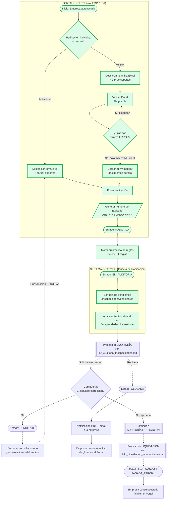

# Levantamiento Funcional — Historias de Usuario

## Módulo de Incapacidades — Proceso: RADICACIÓN

---

## 1. Encabezado del Documento

| Campo | Valor |
|---|---|
| Código de Necesidad/Proyecto | _(diligenciar)_ |
| Nombre Necesidad/Proyecto | Módulo de Incapacidades — Radicación |
| Área Solicitante | _(diligenciar)_ |
| Usuarios Aprobadores | _(diligenciar)_ |
| Áreas Impactadas | Radicación / Servicio al Cliente / Operaciones ARL |
| Aplicaciones Impactadas | Portal-Externo (empresas aportantes) · Sistema-Interno (analistas de radicación) |
| Responsable Funcional | _(diligenciar)_ |
| Usuarios Pruebas UAT | _(diligenciar)_ |

> **Nota de alcance**: este documento cubre exclusivamente el proceso de **Radicación**. Los procesos de Auditoría y Liquidación se documentan en `HU_Auditoria_Incapacidades.md` y `HU_Liquidacion_Incapacidades.md` respectivamente. **No se incluye ninguna historia relacionada con el módulo de "pre-incapacidades"** (bandeja, verificación documental, devolución y promoción vía `pre_incapacidad_*`): ese canal de radicación fue confirmado como **deprecado** por el área funcional y se excluye en su totalidad de este levantamiento, incluso como base para nuevas historias.

---

## 2. Control de Cambio al Documento

| Fecha | Versión | Responsable | Descripción del cambio | Aplicación |
|---|---|---|---|---|
| 2026-07-16 | 1.0 | Analista Funcional (Claude Code) | Creación del documento a partir de levantamiento de código fuente (backend, portal-externo, sistema-interno) | Portal-Externo / Sistema-Interno |

---

## 3. Diagrama de Proceso / Hito TO-BE

El diagrama siguiente representa el flujo end-to-end del módulo de Incapacidades para dar contexto completo; **este documento detalla únicamente el tramo de Radicación** (resaltado). Los tramos de Auditoría y Liquidación se documentan en sus respectivos archivos.



**Compuertas de decisión relevantes al tramo de Radicación**:
- **A6**: fila de Excel con al menos una inconsistencia de severidad `ERROR` bloquea la radicación de esa fila; las de severidad `WARNING` son advisoria (no bloquean).
- **E1 / F1**: cuando el auditor solicita información (estado `PENDIENTE`), la empresa debe poder corregir/complementar el radicado desde el Portal — funcionalidad marcada **NUEVA** (ver HU-RAD-09).

---

## 4. Detalle Situación Actual de la(s) Aplicación(es)

### PORTAL-EXTERNO

1. **Autenticación**: el portal dejó de ser público/anónimo (cambio confirmado en el código, 2026-06-20); solo usuarios con `rol=EMPRESA` y `empresa_id` asignado pueden ingresar. El login (`POST /auth/login`) usa flujo tipo OAuth2-password. Si el usuario autenticado no cumple el rol, se bloquea el acceso con el mensaje *"No tiene acceso a este portal. Contacte a Servicio al Cliente."*
2. **Radicación individual**: formulario de una sola pantalla (no wizard multi-paso, a pesar de que existe código muerto de un esquema de wizard de 2 pasos sin usar) donde la empresa selecciona un empleado activo de su nómina, diligencia los datos clínicos y adjunta soportes. Es **exclusivo para incapacidades ARL** — no existe opción de origen SALUD en este formulario.
3. **Radicación masiva**: flujo de 3 pasos — descarga de plantilla Excel (opcionalmente prellenada por empleados seleccionados), carga y validación fila-por-fila del Excel diligenciado, y carga de un ZIP con los soportes documentales nombrados con la convención `{numero_documento}_{TIPO}.ext`. El sistema distingue errores bloqueantes de advertencias no bloqueantes.
4. **Cargue de documentos**: componente genérico de arrastrar-y-soltar, valida extensión/MIME y tamaño máximo (10 MB) por archivo antes de intentar el envío.
5. **Consulta de estado**: pantalla con filtros (estado, documento de empleado, rango de fecha de inicio) sobre las incapacidades de la propia empresa (`GET /incapacidades/mi-empresa`), con detalle en panel lateral que incluye línea de tiempo de estados.
6. **Salida de información**: al radicar exitosamente, el backend genera el número de radicado y dispara de forma asíncrona (Celery) el paso a auditoría; el Portal no genera comprobante imprimible ni descargable.

**Hallazgos técnicos relevantes para las pruebas UAT** (no son historias de usuario, pero condicionan la validación):
- El componente de notificaciones toast (`useToast`) no tiene un `<Toaster/>` montado en la aplicación — los mensajes de éxito/error de radicación actualmente **no se ven en pantalla**, aunque la lógica de negocio subyacente sí se ejecuta. Se recomienda una corrección técnica antes de UAT.
- El cliente axios usado por "Consulta de estado" y el autocompletar CIE-10 no participa del interceptor de renovación automática de token (sí lo tiene el resto del portal) — una sesión cerca de expirar puede fallar silenciosamente en esas dos pantallas.

### SISTEMA-INTERNO

1. **Bandeja de radicados pendientes** (`/incapacidades/pendientes`): cola de trabajo para analistas/auditores con los estados `RADICADA`, `EN_AUDITORIA` y `PENDIENTE`, ordenada por prioridad (`URGENTE > ALTA > NORMAL > BAJA`) y antigüedad. Se refresca automáticamente cada 2 minutos. Permite filtrar por tipo (ARL/SALUD), prioridad, NIT de empresa y antigüedad mínima en días.
2. **Dashboard** (`/dashboard`): vista analítica con métricas (pendientes, auditadas hoy, próximas a vencer, rechazadas/observadas) y una tabla de incapacidades con paginación real del lado del servidor — a diferencia de la bandeja de pendientes, que no pagina (trae hasta 100 registros fijos).
3. **Apertura de caso**: desde cualquier bandeja, el botón "Gestionar" navega a `/incapacidades/{id}/gestionar`, pantalla que ya pertenece funcionalmente al proceso de **Auditoría** (ver documento correspondiente).
4. **Asignación a analista**: no existe ningún mecanismo de asignación de un radicado a un analista específico — todos los analistas/auditores ven la misma bandeja compartida sin dueño asignado.

---

## 5. Funcionalidades Impactadas

| Aplicación | Funcionalidad | EXISTENTE (ruta código/menú) | NUEVA (ruta donde se requiere) |
|---|---|---|---|
| Portal-Externo | Autenticación de empresa | `src/pages/LoginPage.tsx`, `POST /auth/login` | — |
| Portal-Externo | Radicación individual ARL | `src/components/radicacion/RadicacionIndividualPage.tsx`, `POST /incapacidades/radicar` | — |
| Portal-Externo | Radicación masiva (Excel + ZIP) | `src/components/radicacion/masiva/RadicacionMasivaPage.tsx`, `POST /incapacidades/radicar-masiva*` | — |
| Portal-Externo | Cargue de soportes documentales | `src/components/ui/FileUpload.tsx`, `src/lib/fileHelpers.ts` | — |
| Portal-Externo | Validación de duplicidad/traslape de fechas en radicación desde el Portal | — | `RadicacionPipelineService` (backend) — hoy solo existe en el canal deprecado de pre-incapacidades |
| Portal-Externo | Generación de número de radicado | `RadicacionPipelineService` (backend) | — |
| Portal-Externo | Comprobante de radicación imprimible/descargable | — | Pantalla de confirmación posterior a `POST /incapacidades/radicar` |
| Portal-Externo | Consulta de estado del radicado | `src/pages/ConsultaEmpresa.tsx`, `GET /incapacidades/mi-empresa` | — |
| Portal-Externo | Notificación visible de éxito/error al radicar | `src/hooks/use-toast.ts` (lógica existe, render falta) | Montaje de `<Toaster/>` en `src/main.tsx` |
| Portal-Externo | Subsanación de radicados en estado PENDIENTE | — | Nueva pantalla/flujo en Portal-Externo, ligado a `PATCH /incapacidades/{id}` |
| Sistema-Interno | Bandeja de radicados pendientes | `src/pages/incapacidades/PendientesPage.tsx`, `GET /incapacidades/pendientes` | — |
| Sistema-Interno | Dashboard con métricas de radicación | `src/pages/dashboard/DashboardPage.tsx` | — |
| Sistema-Interno | Asignación de radicado a analista | — | Bandeja de pendientes + campo `analista_asignado_id` (no existe en modelo actual) |
| Sistema-Interno | Paginación real en bandeja de pendientes | `src/components/shared/DataTable.tsx` (sin pager) | Mejora sobre el mismo componente |

---

## 6. Requerimientos y Criterios de Aceptación por Aplicación

```
APLICACIÓN: PORTAL-EXTERNO / # Requerimiento JIRA: ____________
  → PROCESO: RADICACIÓN
```

### Historia de Usuario 1:
**Autenticación de empresa en el Portal-Externo**

**Yo Como** representante de una empresa aportante (rol EMPRESA)
**Quiero** iniciar sesión en el Portal-Externo con mis credenciales
**Para** poder radicar incapacidades y consultar el estado de mis trámites de forma segura

Criterios de aceptación

1. **CA1: Login exitoso con rol EMPRESA**
   Dado que tengo un usuario activo con `rol=EMPRESA` y `empresa_id` asignado
   Cuando ingreso mi usuario y contraseña correctos en el formulario de login
   Entonces el sistema me autentica y me redirige a la pantalla principal del portal
   Y el token de acceso queda almacenado para las siguientes peticiones

   Regla de negocio:
   - Solo usuarios con `rol=EMPRESA` y `empresa_id` no nulo pueden operar el portal (`ProtectedRoute.tsx`).

2. **CA2: Credenciales inválidas**
   Dado que estoy en el formulario de login
   Cuando ingreso un usuario o contraseña incorrectos
   Entonces el sistema muestra el mensaje "Usuario o contraseña inválidos."
   Y no se genera ninguna sesión ni se almacena token

3. **CA3: Control de acceso por rol — usuario sin permiso de portal**
   Dado que mis credenciales son válidas pero mi usuario NO tiene `rol=EMPRESA` (por ejemplo AUDITOR o ADMIN) o no tiene `empresa_id` asignado
   Cuando intento iniciar sesión
   Entonces el sistema muestra el mensaje "No tiene acceso a este portal. Contacte a Servicio al Cliente."
   Y no me otorga acceso a ninguna pantalla del portal

   Regla de negocio:
   - El Portal-Externo es de uso exclusivo del rol EMPRESA; los demás roles corresponden al Sistema-Interno.

4. **CA4: Sesión expirada durante el uso**
   Dado que mi token de acceso expiró mientras navego el portal
   Cuando el sistema detecta una respuesta 401 de la API
   Entonces intenta renovar el token de forma transparente usando el refresh token
   Y si la renovación falla, me redirige automáticamente a la pantalla de login

   Regla de negocio:
   - Access token: 15 minutos. Refresh token: 7 días (hash SHA256 en BD).

5. **CA5: Intento de acceso a una URL protegida sin sesión**
   Dado que no tengo una sesión activa
   Cuando intento acceder directamente a una ruta protegida (ej. `/radicar/individual`)
   Entonces el sistema me redirige a `/login`

---

### Historia de Usuario 2:
**Radicación individual de incapacidad ARL**

**Yo Como** representante de empresa aportante (rol EMPRESA)
**Quiero** radicar una incapacidad de origen laboral (ARL) para uno de mis empleados
**Para** iniciar el trámite de reconocimiento y pago ante la ARL

Criterios de aceptación

1. **CA1: Radicación exitosa con datos completos**
   Dado que estoy autenticado como EMPRESA y he seleccionado un empleado activo de mi nómina
   Cuando diligencio tipo de enfermedad, fechas de inicio y fin, diagnóstico CIE-10, nombre y registro del médico tratante, y adjunto el documento de incapacidad médica
   Y presiono "Radicar Incapacidad"
   Entonces el sistema crea la incapacidad en estado `RADICADA`, genera un número de radicado con formato `ARL-YYYYMMDD-NNNN` y me redirige a la pantalla de Consulta
   Y encola automáticamente el paso a auditoría (`EN_AUDITORIA`)

   Regla de negocio:
   - Este formulario solo admite `tipo_enfermedad` ∈ {`ACCIDENTE_TRABAJO`, `ENFERMEDAD_LABORAL`, `ACCIDENTE_TRAYECTO`} — no existe radicación de origen SALUD desde este formulario.
   - `dias_totales` se calcula automáticamente como `fecha_fin - fecha_inicio + 1` (mínimo 1), no es editable por el usuario.
   - El empleado solo puede seleccionarse si su estado es `ACTIVO` (filtro server-side en el buscador de empleados).

2. **CA2: Validación de formato de datos**
   Dado que estoy diligenciando el formulario de radicación individual
   Cuando ingreso un código de diagnóstico CIE-10 con formato inválido (ej. `AB12` o `A1234`)
   Entonces el campo muestra el error "Formato CIE-10 inválido (ej: A048, M545 o A09X)"
   Y el botón de envío permanece deshabilitado hasta corregir el dato

   Regla de negocio:
   - Formato CIE-10 vigente: `^[A-Z]\d{2}[0-9X]$` (Resolución 1273, 4 caracteres, sin punto decimal).
   - Fecha fin debe ser igual o posterior a fecha inicio; fecha inicio/fin no pueden ser posteriores a hoy + 30 días.
   - Nombre del médico: 2–200 caracteres. Registro médico: 3–50 caracteres, solo letras/números/guiones.

3. **CA3: Documento obligatorio faltante**
   Dado que he diligenciado todos los campos del formulario
   Cuando intento enviar la radicación sin haber adjuntado el documento de "Incapacidad Médica"
   Entonces el sistema me impide continuar y me indica que debo adjuntar el documento de incapacidad médica
   Y el botón de envío permanece deshabilitado

   Regla de negocio:
   - "Incapacidad Médica" es obligatorio (máx. 1 archivo). "Historia Clínica" (hasta 3) y "Soportes Adicionales" (hasta 5) son opcionales, sin diferenciación por `tipo_enfermedad`.
   - Formatos permitidos: PDF, JPG, JPEG, PNG. Tamaño máximo: 10 MB por archivo.

4. **CA4: Rechazo por regla de negocio del backend (duplicidad/traslape)**
   Dado que envío una radicación para un empleado que ya tiene una incapacidad activa con fechas que se traslapan
   Cuando el backend evalúa la solicitud
   Entonces la radicación de ese ítem no se completa y el sistema muestra el mensaje de error devuelto por el backend
   Y el radicado no cambia a estado `RADICADA`

   Regla de negocio:
   - **[SUPUESTO — VALIDAR]**: actualmente la validación de duplicidad/traslape de fechas (RN008/RN009) solo está implementada en el canal deprecado de pre-incapacidades. Para que este CA se cumpla en el canal vigente (`RadicacionPipelineService`), es necesario portar esa validación — se marca como brecha a cerrar, no como comportamiento actual confirmado.

5. **CA5: Control de acceso por rol**
   Dado que un usuario no autenticado o sin `rol=EMPRESA` intenta invocar `POST /incapacidades/radicar`
   Cuando la petición llega al backend
   Entonces el sistema responde con error de autorización y no crea ningún registro

   Regla de negocio:
   - Endpoint protegido por dependencia `require_empresa`, que además fuerza el `empresa_id` desde el JWT (el cliente no puede radicar a nombre de otra empresa).

---

### Historia de Usuario 3:
**Radicación masiva de incapacidades vía Excel y ZIP**

**Yo Como** representante de empresa aportante (rol EMPRESA)
**Quiero** radicar múltiples incapacidades a la vez mediante una plantilla Excel y un archivo ZIP de soportes
**Para** agilizar la radicación cuando tengo varios casos pendientes de reportar

Criterios de aceptación

1. **CA1: Descarga de plantilla prellenada**
   Dado que estoy en la pantalla de radicación masiva
   Cuando selecciono uno o varios empleados de mi nómina y presiono "Descargar plantilla"
   Entonces el sistema descarga un archivo `plantilla_incapacidades.xlsx` con las filas prellenadas con los datos de esos empleados
   Y si no selecciono ningún empleado, la plantilla se descarga solo con los encabezados de columnas

   Regla de negocio:
   - Columnas de la plantilla: `numero_documento*`, `tipo_documento`, `empleado_nombres`, `empleado_apellidos`, `tipo_enfermedad*`, `fecha_inicio*`, `fecha_fin*`, `dias_totales`, `diagnostico_cie10*`, `descripcion_diagnostico`, `nombre_medico*`, `registro_medico*`, `ips`, `prorroga` (SI/NO, default NO), `observaciones`. Los campos marcados con `*` son obligatorios.

2. **CA2: Validación de Excel con errores bloqueantes y advertencias**
   Dado que subo el Excel diligenciado
   Cuando el sistema valida cada fila
   Entonces las inconsistencias de severidad `ERROR` (ej. CIE-10 inexistente en catálogo, campo obligatorio vacío) se muestran en rojo y bloquean esa fila
   Y las inconsistencias de severidad `WARNING` (ej. duración excede 180 días, radicación retroactiva mayor a 30 días) se muestran en ámbar y NO bloquean la radicación de la fila

   Regla de negocio:
   - Una fila se considera "válida"/lista para radicar cuando no tiene inconsistencias `ERROR`, sin importar cuántas `WARNING` tenga (decisión de diseño: warnings son advisorios).
   - El código de diagnóstico CIE-10 se valida contra el catálogo real en base de datos (no solo el formato).

3. **CA3: Carga y mapeo del ZIP de soportes**
   Dado que ya tengo filas validadas en la tabla
   Cuando cargo un archivo ZIP (máximo 20 MB) con documentos nombrados como `{numero_documento}_{TIPO}.ext`
   Entonces el sistema mapea automáticamente cada documento a la fila del empleado correspondiente según su número de documento y tipo
   Y muestra la confirmación "ZIP procesado — N documento(s) reconocido(s)"

   Regla de negocio:
   - `TIPO` reconocido: `INCAPACIDAD` (obligatorio por fila), `HISTORIA_CLINICA` (opcional), `SOPORTE*` (opcional). Archivos que no siguen la convención de nombre se ignoran silenciosamente.

4. **CA4: Bloqueo de envío por filas incompletas**
   Dado que tengo filas sin el documento obligatorio `INCAPACIDAD` adjunto, o con errores de validación, o con empleado no reconocido
   Cuando intento radicar el lote
   Entonces el sistema no envía la solicitud y muestra un listado de "N fila(s) impiden radicar" con el motivo puntual de cada una (errores de validación / empleado no reconocido / falta documento)
   Y cada motivo permite hacer clic para desplazarme directamente a la fila correspondiente

5. **CA5: Resumen de resultados tras el envío**
   Dado que envío un lote con filas listas
   Cuando el backend procesa la radicación masiva
   Entonces el sistema muestra un modal "Radicación completada" con una tabla de radicaciones exitosas (número de documento, número de radicado, días) y, si aplica, un listado de registros no radicados con su motivo de error
   Y desde el modal puedo navegar a "Ir a consulta" para ver el estado de mis radicados

   Regla de negocio:
   - El backend revalida cada fila server-side de forma independiente al resultado de la validación previa del Excel — el cliente nunca es la fuente de verdad final.

---

### Historia de Usuario 4:
**Cargue de soportes documentales de una incapacidad**

**Yo Como** representante de empresa aportante (rol EMPRESA)
**Quiero** adjuntar los documentos de soporte de una incapacidad (incapacidad médica, historia clínica, soportes adicionales)
**Para** que el auditor cuente con la evidencia necesaria para evaluar el caso

Criterios de aceptación

1. **CA1: Carga exitosa de un archivo válido**
   Dado que estoy en el paso de cargue de documentos
   Cuando selecciono o arrastro un archivo PDF, JPG o PNG de máximo 10 MB
   Entonces el archivo se agrega a la lista de adjuntos con su nombre y tamaño legible
   Y puedo removerlo antes de enviar con el botón de eliminar

2. **CA2: Rechazo de formato no permitido**
   Dado que intento adjuntar un archivo con extensión no soportada (ej. `.xls`, `.mp4`)
   Cuando el sistema valida el archivo
   Entonces muestra el mensaje "Tipo de archivo no permitido. Solo se aceptan: PDF, JPG, JPEG, PNG"
   Y el archivo no se agrega a la lista

3. **CA3: Rechazo por tamaño excedido**
   Dado que intento adjuntar un archivo mayor a 10 MB
   Cuando el sistema valida el archivo
   Entonces muestra el mensaje "El archivo excede el tamaño máximo de 10 MB"
   Y el archivo no se agrega a la lista

4. **CA4: Límite de cantidad de archivos por tipo**
   Dado que ya adjunté el máximo de archivos permitido para un tipo de documento (1 para incapacidad médica, 3 para historia clínica, 5 para soportes adicionales)
   Cuando intento adjuntar un archivo adicional de ese mismo tipo
   Entonces el sistema muestra "Solo se permiten hasta N archivos" y no lo agrega

   Regla de negocio:
   - **[SUPUESTO — VALIDAR]**: la obligatoriedad y cantidad de documentos actualmente NO varía según `tipo_enfermedad` (ACCIDENTE_TRABAJO / ENFERMEDAD_LABORAL / ACCIDENTE_TRAYECTO) — el único documento obligatorio en todos los casos es "Incapacidad Médica". Confirmar con el área funcional si se requiere una matriz de obligatoriedad diferenciada (ej. FURAT obligatorio solo para accidente de trabajo).

5. **CA5: Integridad del documento almacenado**
   Dado que un documento fue cargado exitosamente
   Cuando el sistema lo persiste
   Entonces calcula y almacena su hash MD5 y SHA256 junto con el archivo
   Y el documento queda disponible para descarga posterior sin alteración

   Regla de negocio:
   - RN011 (Conservación de evidencia): los documentos cargados deben almacenarse sin alteración.

---

### Historia de Usuario 5:
**Generación de número de radicado**

**Yo Como** sistema (en representación de la empresa que radica)
**Quiero** generar un número de radicado único e irrepetible al momento de crear una incapacidad
**Para** que la empresa y el auditor puedan identificar y rastrear el caso de forma inequívoca

Criterios de aceptación

1. **CA1: Formato del número de radicado**
   Dado que se crea exitosamente una incapacidad de tipo ARL
   Cuando el sistema genera el número de radicado
   Entonces el número sigue el formato `ARL-YYYYMMDD-NNNN` (o `SAL-YYYYMMDD-NNNN` para SALUD), con `NNNN` como consecutivo del día

   Regla de negocio:
   - RN002/RN003: toda solicitud recibida exitosamente genera número único de radicado, fecha/hora de radicación y estado inicial `RADICADA`. No pueden existir dos radicados con el mismo consecutivo.

2. **CA2: Manejo de colisión de consecutivo**
   Dado que dos radicaciones concurrentes intentan obtener el mismo consecutivo del día
   Cuando ocurre una colisión a nivel de base de datos
   Entonces el sistema reintenta automáticamente la generación del número (mediante SAVEPOINT) hasta obtener uno disponible
   Y ninguna de las dos radicaciones falla por esta causa

3. **CA3: Confirmación al solicitante**
   Dado que la radicación se completó exitosamente
   Cuando el sistema responde al Portal-Externo
   Entonces informa el número de radicado, la fecha de radicación y el estado inicial `RADICADA`

   Regla de negocio:
   - RN009: después de radicar exitosamente se debe informar número de radicado, fecha de radicación y canales de consulta.

4. **CA4: Comprobante de radicación (NUEVA)**
   Dado que acabo de radicar una incapacidad exitosamente
   Cuando el sistema confirma la creación del radicado
   Entonces puedo descargar o imprimir un comprobante en PDF con el número de radicado, fecha/hora, datos del empleado y resumen de la incapacidad radicada

   Regla de negocio:
   - **[SUPUESTO — VALIDAR]**: esta funcionalidad no existe hoy en el código (ni en radicación individual ni masiva); se documenta como requerimiento nuevo derivado de RN009 ("canales de consulta" informados al solicitante).

5. **CA5: Recepción 24/7**
   Dado que un usuario EMPRESA desea radicar en cualquier momento
   Cuando envía la solicitud, sin importar el día u hora
   Entonces el sistema la procesa con la misma disponibilidad que en horario hábil

   Regla de negocio:
   - RN001: el sistema debe permitir la radicación de solicitudes las 24 horas del día.

---

### Historia de Usuario 6:
**Consulta de estado del radicado**

**Yo Como** representante de empresa aportante (rol EMPRESA)
**Quiero** consultar el estado de mis incapacidades radicadas y su historial de cambios
**Para** hacer seguimiento al trámite sin necesidad de contactar a Servicio al Cliente

Criterios de aceptación

1. **CA1: Listado filtrable de incapacidades de mi empresa**
   Dado que estoy autenticado como EMPRESA
   Cuando accedo a la pantalla de "Consulta"
   Entonces veo únicamente las incapacidades radicadas por mi propia empresa, con columnas de número, empleado, CIE-10, período, días y estado
   Y puedo filtrar por estado, documento del empleado y rango de fecha de inicio

   Regla de negocio:
   - Los estados visibles incluyen todo el ciclo: `RADICADA, EN_AUDITORIA, PENDIENTE, CREACION_SINIESTRO, LIQUIDACION, LIQUIDACION_PARCIAL, GLOSADA, PAGADA, PAGADA_PARCIAL`.

2. **CA2: Detalle y línea de tiempo de un radicado**
   Dado que tengo un radicado en el listado
   Cuando hago clic sobre la fila
   Entonces se abre un panel lateral con el detalle completo (solicitante, datos médicos, fechas) y una línea de tiempo cronológica de los cambios de estado

   Regla de negocio:
   - La información expuesta al Portal está sanitizada: no incluye valores monetarios ni datos bancarios (esos son de uso exclusivo del Sistema-Interno).

3. **CA3: Visualización de observaciones del auditor en estado PENDIENTE**
   Dado que un radicado se encuentra en estado `PENDIENTE`
   Cuando abro su detalle
   Entonces veo un bloque destacado "Observaciones del auditor" con el texto registrado por el auditor al solicitar la información adicional

4. **CA4: Motivo de una glosa**
   Dado que un radicado se encuentra en estado `GLOSADA`
   Cuando abro su detalle
   Entonces veo el aviso "Incapacidad Glosada — Esta incapacidad ha sido glosada. El motivo fue comunicado por correo electrónico a la empresa."

5. **CA5: Sin resultados para los filtros aplicados**
   Dado que aplico filtros que no coinciden con ningún radicado
   Cuando el sistema ejecuta la búsqueda
   Entonces muestra el mensaje "No hay incapacidades para los filtros seleccionados."

6. **CA6: Error de carga de la información**
   Dado que ocurre un error de comunicación con el servidor al consultar
   Cuando la petición falla
   Entonces el sistema muestra el mensaje "No se pudieron cargar las incapacidades. Intente nuevamente."

---

### Historia de Usuario 7:
**Notificación visible de resultado de radicación**

**Yo Como** representante de empresa aportante (rol EMPRESA)
**Quiero** ver claramente en pantalla si mi radicación fue exitosa o falló, y por qué
**Para** saber si debo tomar alguna acción adicional sin depender de adivinar el resultado

Criterios de aceptación

1. **CA1: Confirmación visible de éxito**
   Dado que radico exitosamente una incapacidad individual
   Cuando el sistema procesa la solicitud
   Entonces veo en pantalla una notificación de éxito con el texto "Incapacidad radicada — Número de radicado: {numero}"

   Regla de negocio:
   - **[HALLAZGO TÉCNICO]**: hoy la lógica de este mensaje existe pero no se renderiza visualmente porque falta montar el componente `<Toaster/>` en la aplicación — se documenta como defecto a corregir antes de dar por cumplido este CA.

2. **CA2: Notificación visible de error de negocio**
   Dado que mi radicación es rechazada por una regla de negocio del backend (ej. traslape de fechas)
   Cuando el sistema recibe la respuesta de error
   Entonces veo en pantalla una notificación de error "Error al radicar" con el detalle específico devuelto por el backend

3. **CA3: Notificación visible de error de red**
   Dado que ocurre un problema de conectividad al enviar la radicación
   Cuando la petición no puede completarse
   Entonces veo en pantalla la notificación "Error de red — Intente nuevamente."

4. **CA4: Persistencia del resultado en radicación masiva**
   Dado que completo una radicación masiva
   Cuando el sistema procesa el lote
   Entonces el resumen de resultados (exitosos y fallidos) se muestra en un modal que permanece visible hasta que yo lo cierre, sin depender de notificaciones tipo toast

---

### Historia de Usuario 8:
**Subsanación de un radicado en estado PENDIENTE**

**Yo Como** representante de empresa aportante (rol EMPRESA)
**Quiero** corregir o complementar la información de un radicado que el auditor devolvió como PENDIENTE
**Para** que el caso pueda continuar su trámite sin necesidad de radicar uno nuevo

Criterios de aceptación

1. **CA1: Acceso a la subsanación desde la consulta**
   Dado que tengo un radicado en estado `PENDIENTE` con observaciones del auditor
   Cuando abro su detalle en la pantalla de Consulta
   Entonces veo una acción "Corregir/Complementar radicado" que me lleva a un formulario prellenado con los datos actuales

   Regla de negocio:
   - **[SUPUESTO — VALIDAR]**: esta funcionalidad no existe en el código actual; se documenta como requerimiento NUEVO derivado del alcance mínimo solicitado. No existe ninguna base de código previa (activa) de la cual derivar el detalle de implementación.

2. **CA2: Envío de la corrección**
   Dado que edité los campos observados o adjunté el documento faltante señalado por el auditor
   Cuando envío la corrección
   Entonces el sistema actualiza el radicado y lo regresa a la cola de auditoría (`PENDIENTE → EN_AUDITORIA`)
   Y registra el cambio en el historial de estados con el usuario y fecha correspondientes

   Regla de negocio:
   - RN004 (Trazabilidad): toda modificación realizada sobre una radicación debe quedar registrada (usuario, fecha, hora, acción).
   - La transición `PENDIENTE → EN_AUDITORIA` ya existe en la máquina de estados del backend; falta el endpoint/flujo de edición desde el Portal.

3. **CA3: Intento de corrección fuera de estado PENDIENTE**
   Dado que un radicado no se encuentra en estado `PENDIENTE`
   Cuando intento acceder a la acción de subsanación
   Entonces el sistema no permite la edición y muestra un mensaje indicando que el radicado no admite corrección en su estado actual

4. **CA4: Validaciones aplicables a la corrección**
   Dado que estoy corrigiendo un radicado
   Cuando modifico campos como fechas o diagnóstico
   Entonces se aplican las mismas validaciones de formato que en la radicación individual (CIE-10, rango de fechas, campos obligatorios)

---

```
APLICACIÓN: SISTEMA-INTERNO / # Requerimiento JIRA: ____________
  → PROCESO: RADICACIÓN (recepción/gestión)
```

### Historia de Usuario 9:
**Bandeja de radicados pendientes**

**Yo Como** analista de radicación / auditor (rol ADMIN o AUDITOR)
**Quiero** ver una cola priorizada de las incapacidades pendientes de gestión
**Para** atender primero los casos más urgentes o antiguos

Criterios de aceptación

1. **CA1: Listado priorizado**
   Dado que accedo a la bandeja de pendientes
   Cuando el sistema carga los registros
   Entonces veo las incapacidades en estado `RADICADA`, `EN_AUDITORIA` o `PENDIENTE`, ordenadas primero por prioridad (`URGENTE > ALTA > NORMAL > BAJA`) y luego por antigüedad (más antiguo primero)

2. **CA2: Filtros de bandeja**
   Dado que estoy en la bandeja de pendientes
   Cuando aplico filtros de tipo (ARL/SALUD), prioridad, NIT de empresa o antigüedad mínima en días
   Entonces la tabla se actualiza mostrando solo los registros que cumplen los filtros seleccionados

3. **CA3: Indicador visual de antigüedad**
   Dado que un radicado lleva más de 7 días sin gestión
   Cuando se muestra en la bandeja
   Entonces su antigüedad se resalta con una insignia de color distintivo (roja si >7 días, estándar si >3 días)

4. **CA4: Bandeja vacía**
   Dado que no hay incapacidades pendientes de gestión
   Cuando cargo la bandeja
   Entonces veo el mensaje "¡No hay pendientes! — Todas las incapacidades están al día."

5. **CA5: Control de acceso por rol**
   Dado que un usuario con `rol=EMPRESA` o `rol=EMPLEADO` intenta acceder a la bandeja de pendientes del Sistema-Interno
   Cuando la aplicación evalúa la ruta
   Entonces le niega el acceso y lo redirige a una pantalla de "No autorizado"

   Regla de negocio:
   - Acceso permitido: ADMIN, AUDITOR (y lectura para APROBADOR/READONLY vía permiso `INCAPACIDAD_READ`).

6. **CA6: Actualización automática de la bandeja**
   Dado que tengo la bandeja abierta
   Cuando transcurren 2 minutos sin interacción
   Entonces el sistema refresca automáticamente el listado para reflejar nuevos radicados

---

### Historia de Usuario 10:
**Asignación de un radicado a un analista**

**Yo Como** coordinador de radicación (rol ADMIN)
**Quiero** asignar cada radicado pendiente a un analista específico
**Para** distribuir la carga de trabajo y tener trazabilidad de quién es responsable de cada caso

Criterios de aceptación

1. **CA1: Asignación manual desde la bandeja**
   Dado que tengo un radicado sin analista asignado en la bandeja de pendientes
   Cuando selecciono un analista de la lista y confirmo la asignación
   Entonces el radicado queda vinculado a ese analista y su nombre se muestra en la columna correspondiente de la bandeja

   Regla de negocio:
   - **[SUPUESTO — VALIDAR]**: no existe en el modelo de datos actual un campo de "analista asignado" a nivel de incapacidad (sí existe `liquidador_id` en el módulo de Liquidación, pero no aplica a este proceso). Requiere nuevo campo y migración de base de datos.

2. **CA2: Filtro por analista asignado**
   Dado que existen radicados asignados a distintos analistas
   Cuando filtro la bandeja por "Mis asignados"
   Entonces solo veo los radicados asignados a mi usuario

3. **CA3: Reasignación**
   Dado que un radicado ya tiene un analista asignado
   Cuando un coordinador (rol ADMIN) lo reasigna a otro analista
   Entonces el cambio queda registrado en el historial con usuario, fecha y analista anterior/nuevo

4. **CA4: Restricción de asignación por rol**
   Dado que un usuario con rol AUDITOR (no ADMIN) intenta asignar un radicado a otro analista
   Cuando ejecuta la acción
   Entonces el sistema le niega el permiso, ya que la asignación es exclusiva del rol ADMIN/coordinador

---

## 7. Diagrama Casos de Uso

### Caso de Uso: Radicación individual de incapacidad ARL (HU-2)

| Campo | Detalle |
|---|---|
| Funcionalidad Antecesora | Autenticación de empresa (HU-1) |
| Precondición | Usuario autenticado con `rol=EMPRESA`; empleado en estado ACTIVO existente en la nómina de la empresa |
| **P1** | Empresa selecciona el empleado desde el buscador — **Ejecutor: Usuario EMPRESA** |
| **P2** | Empresa diligencia tipo de enfermedad, fechas, diagnóstico CIE-10 y datos del médico — **Ejecutor: Usuario EMPRESA** |
| **P3** | Empresa adjunta el documento de incapacidad médica (obligatorio) y soportes opcionales — **Ejecutor: Usuario EMPRESA** |
| **P4** | Sistema valida formato de campos (Zod) en el cliente — **Ejecutor: Sistema (Portal-Externo)** |
| **P5** | Empresa envía el formulario — **Ejecutor: Usuario EMPRESA** |
| **P6** | Sistema revalida reglas de negocio en el servidor y persiste la incapacidad — **Ejecutor: Sistema (Backend)** |
| **P7** | Sistema genera número de radicado único y cambia estado a `RADICADA` — **Ejecutor: Sistema (Backend)** |
| **P8** | Sistema encola de forma asíncrona el paso automático a `EN_AUDITORIA` — **Ejecutor: Sistema (Celery)** |
| **P9** | Sistema notifica el resultado a la empresa y redirige a Consulta — **Ejecutor: Sistema (Portal-Externo)** |
| Postcondición | Incapacidad creada en estado `RADICADA` (o `EN_AUDITORIA` tras el job asíncrono), con documentos asociados y número de radicado generado |
| Reglas de Negocio | RN001, RN002, RN003, RN008, RN009, RN012 (ver `ai/skills/negocio/incapacidad_radicacion/reglas_negocio.md`) |
| Excepciones | Documento obligatorio faltante; formato de campo inválido; empleado inactivo o no encontrado; error de negocio del backend (traslape/duplicidad) |
| Volumetrías | **[SUPUESTO — VALIDAR]**: no se encontró información de volumetría esperada en el código o documentación; solicitar al área de negocio el volumen mensual estimado de radicaciones individuales |
| Frecuencia de Ejecución | Bajo demanda, 24/7 (RN001) |
| Posibles Alertas | Radicado con antigüedad > 7 días sin gestión (visible en bandeja del Sistema-Interno) |
| Funcionalidad Predecesora | Cargue de soportes documentales (HU-4) — se ejecuta dentro del mismo caso de uso |

### Caso de Uso: Radicación masiva de incapacidades (HU-3)

| Campo | Detalle |
|---|---|
| Funcionalidad Antecesora | Autenticación de empresa (HU-1) |
| Precondición | Usuario autenticado con `rol=EMPRESA`; plantilla Excel diligenciada; ZIP de soportes nombrado según convención |
| **P1** | Empresa descarga la plantilla (opcionalmente prellenada) — **Ejecutor: Usuario EMPRESA** |
| **P2** | Empresa diligencia el Excel fuera del sistema — **Ejecutor: Usuario EMPRESA** |
| **P3** | Empresa carga el Excel; sistema valida fila por fila — **Ejecutor: Sistema (Backend)** |
| **P4** | Empresa corrige filas con errores `ERROR` si existen — **Ejecutor: Usuario EMPRESA** |
| **P5** | Empresa carga el ZIP de soportes; sistema mapea documentos a filas — **Ejecutor: Sistema (Backend + cliente)** |
| **P6** | Empresa envía el lote de filas listas — **Ejecutor: Usuario EMPRESA** |
| **P7** | Sistema revalida cada fila server-side de forma independiente y radica las válidas — **Ejecutor: Sistema (Backend)** |
| **P8** | Sistema presenta resumen de radicados exitosos y fallidos — **Ejecutor: Sistema (Portal-Externo)** |
| Postcondición | N incapacidades creadas en estado `RADICADA` con sus documentos asociados; filas fallidas no generan registro |
| Reglas de Negocio | RN001, RN002, RN003, RN008, RN009, RN012; severidad ERROR vs WARNING (decisión D10, ver memoria de proyecto) |
| Excepciones | Excel con formato incorrecto; ZIP corrupto o mayor a 20 MB; filas con empleado no reconocido; filas con CIE-10 inexistente en catálogo |
| Volumetrías | **[SUPUESTO — VALIDAR]**: solicitar al área de negocio el volumen máximo de filas esperado por lote |
| Frecuencia de Ejecución | Bajo demanda, 24/7 |
| Posibles Alertas | Ninguna identificada en código; **[SUPUESTO — VALIDAR]** si se requiere alerta por lotes con alta tasa de fallos |
| Funcionalidad Predecesora | Ninguna |

### Caso de Uso: Bandeja de radicados pendientes (HU-9)

| Campo | Detalle |
|---|---|
| Funcionalidad Antecesora | Radicación individual o masiva (HU-2, HU-3) + motor automático de reglas de auditoría |
| Precondición | Usuario autenticado con rol ADMIN o AUDITOR; existen incapacidades en estado RADICADA/EN_AUDITORIA/PENDIENTE |
| **P1** | Analista/auditor accede a la bandeja de pendientes — **Ejecutor: Usuario ADMIN/AUDITOR** |
| **P2** | Sistema consulta y ordena los registros por prioridad y antigüedad — **Ejecutor: Sistema (Backend)** |
| **P3** | Usuario aplica filtros opcionales — **Ejecutor: Usuario ADMIN/AUDITOR** |
| **P4** | Usuario selecciona un caso y presiona "Gestionar" — **Ejecutor: Usuario ADMIN/AUDITOR** |
| Postcondición | Usuario navega al espacio de trabajo de Auditoría (`/incapacidades/{id}/gestionar`) — ver `HU_Auditoria_Incapacidades.md` |
| Reglas de Negocio | Orden de prioridad `URGENTE > ALTA > NORMAL > BAJA`, luego antigüedad ascendente |
| Excepciones | Bandeja vacía; error de carga del listado |
| Volumetrías | **[SUPUESTO — VALIDAR]**: la bandeja no tiene paginación real (límite fijo de 100 registros) — validar si el volumen de pendientes puede superar ese límite en producción |
| Frecuencia de Ejecución | Consulta continua durante la jornada laboral del equipo de auditoría; auto-refresco cada 2 minutos |
| Posibles Alertas | Antigüedad > 7 días (visual, no notificación push/email) |
| Funcionalidad Predecesora | Ninguna dentro de este proceso |

---

## 8. Dependencia de Otras Necesidades/Proyectos

| Proyecto/Necesidad | Tipo de Dependencia | Descripción |
|---|---|---|
| HU_Auditoria_Incapacidades.md | Sucesora | El resultado de la radicación (estado `RADICADA`/`EN_AUDITORIA`) es la entrada del proceso de Auditoría |
| Integración externa "Imaginex" | Dependencia técnica (backend) | Punto de integración mencionado en el código (`IntegracionService.procesar`) invocado durante la radicación; su alcance funcional completo no está documentado — **[SUPUESTO — VALIDAR]** |
| Catálogo CIE-10 | Dependencia de datos | La validación de diagnóstico depende de un catálogo de ~22.000 códigos precargado en base de datos |

---

## 9. Anexos

| Nombre Anexo | Adjunto | Aplicativo y Funcionalidad |
|---|---|---|
| No Aplica | — | — |

---

## 10. Tabla Resumen

| N° HU | Aplicación | Proceso | Nombre HU | # CAs | Funcionalidad Existente/Nueva |
|---|---|---|---|---|---|
| HU-1 | Portal-Externo | Radicación | Autenticación de empresa | 5 | Existente |
| HU-2 | Portal-Externo | Radicación | Radicación individual ARL | 5 | Existente (CA4 parcial) |
| HU-3 | Portal-Externo | Radicación | Radicación masiva Excel+ZIP | 5 | Existente |
| HU-4 | Portal-Externo | Radicación | Cargue de soportes documentales | 5 | Existente (CA4 parcial) |
| HU-5 | Portal-Externo | Radicación | Generación de número de radicado | 5 | Existente (CA4 nueva) |
| HU-6 | Portal-Externo | Radicación | Consulta de estado del radicado | 6 | Existente |
| HU-7 | Portal-Externo | Radicación | Notificación visible del resultado | 4 | Existente (defecto técnico, CA1) |
| HU-8 | Portal-Externo | Radicación | Subsanación de radicado PENDIENTE | 4 | **Nueva** |
| HU-9 | Sistema-Interno | Radicación (gestión) | Bandeja de radicados pendientes | 6 | Existente |
| HU-10 | Sistema-Interno | Radicación (gestión) | Asignación de radicado a analista | 4 | **Nueva** |

---

## 11. Supuestos y Pendientes por Validar con el Área Funcional

1. **[SUPUESTO]** El módulo de "pre-incapacidades" (bandeja, verificación documental, devolución con causal, promoción) fue confirmado como deprecado y se excluyó totalmente de este documento. Como consecuencia, **hoy no existe ningún gate manual de verificación documental** entre `RADICADA` y `EN_AUDITORIA` en el canal vigente: el paso es 100% automático. Si el negocio requiere reintroducir una verificación documental manual previa a auditoría, debe especificarse como un nuevo requerimiento (no cubierto en este documento).
2. **[SUPUESTO]** La validación de duplicidad/traslape de fechas (RN008/RN009 del dominio de auditoría) hoy solo corre en el canal deprecado de pre-incapacidades. Confirmar si debe portarse al canal vigente de radicación (`RadicacionPipelineService`) como parte de este alcance o de auditoría.
3. **[PENDIENTE]** Comprobante de radicación imprimible/descargable (HU-5, CA4): no existe evidencia de código; se requiere definir contenido y formato exacto con el área funcional.
4. **[PENDIENTE]** Subsanación de radicados en estado PENDIENTE (HU-8): no existe ninguna base de código (activa) de la cual derivar el detalle; se requiere definición completa de diseño de pantalla con el área funcional.
5. **[PENDIENTE]** Asignación de radicado a analista (HU-10): requiere nuevo campo en modelo de datos y definición de reglas de reasignación/balanceo de carga.
6. **[HALLAZGO TÉCNICO — no requiere decisión de negocio, sí corrección]** Falta el componente `<Toaster/>` en el Portal-Externo; todos los mensajes de éxito/error de radicación son invisibles hoy en la interfaz aunque la lógica se ejecuta correctamente.
7. **[SUPUESTO]** Volumetrías de radicación (individual y masiva) no están documentadas en el código; se solicitan al área funcional para dimensionar pruebas de carga y UAT.
8. **[PENDIENTE]** Matriz de obligatoriedad de documentos por tipo de incapacidad (ej. FURAT obligatorio solo para accidente de trabajo): hoy es uniforme para todos los tipos; validar si se requiere diferenciación.
