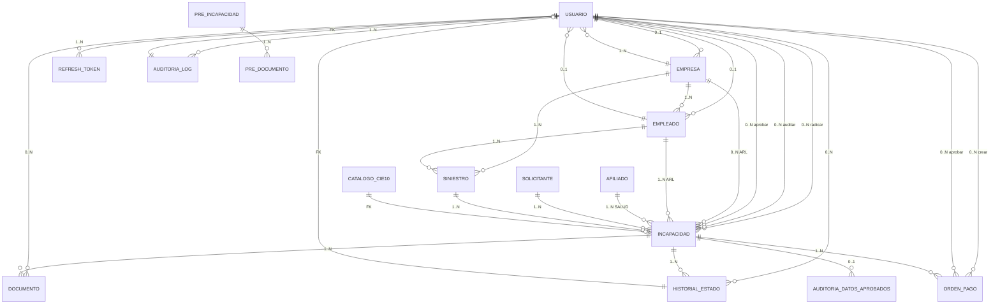
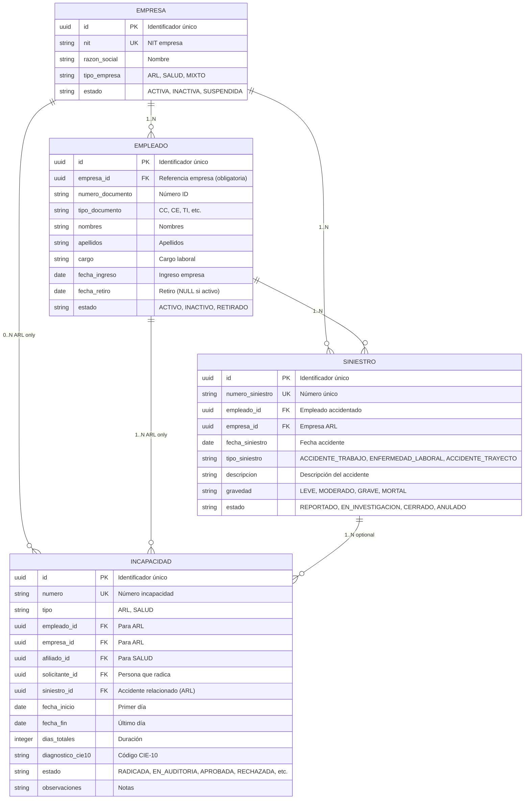
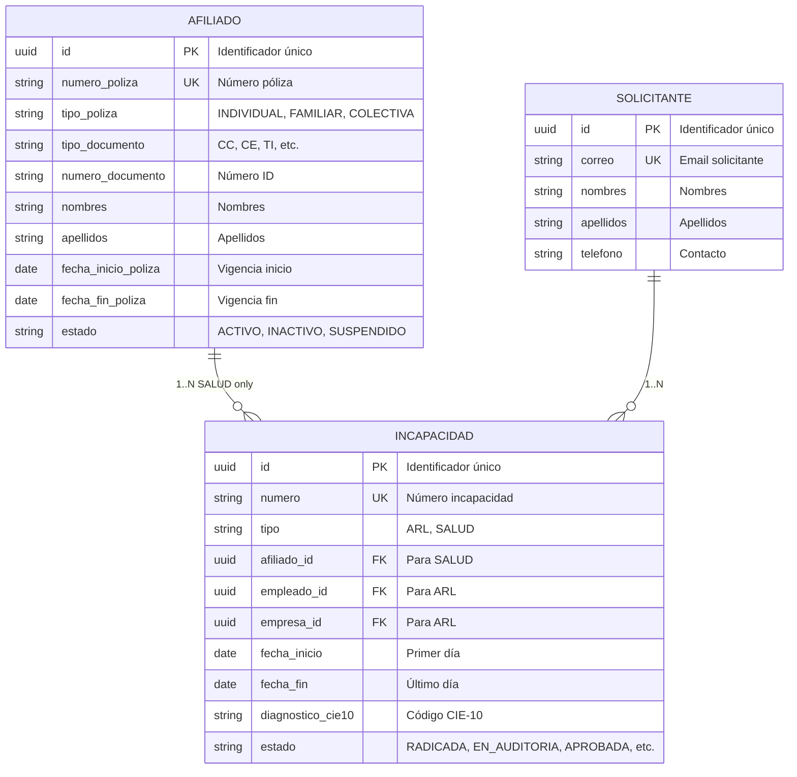
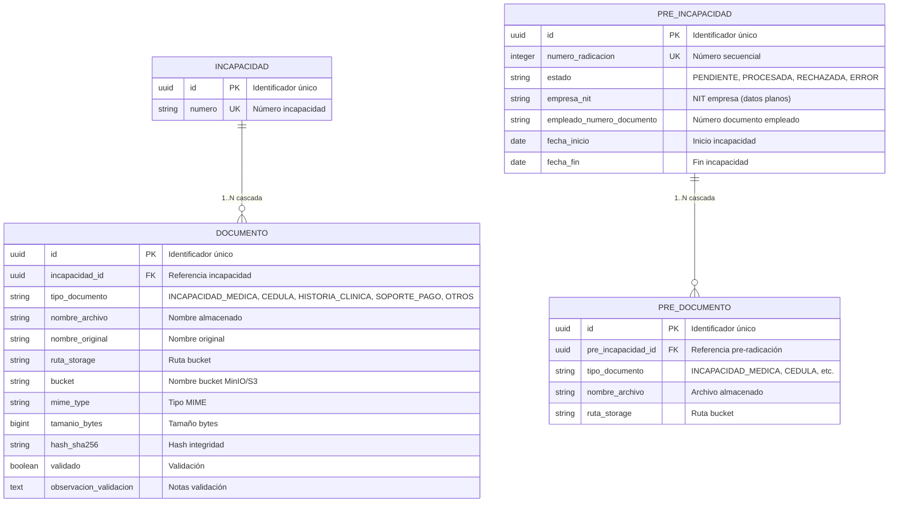
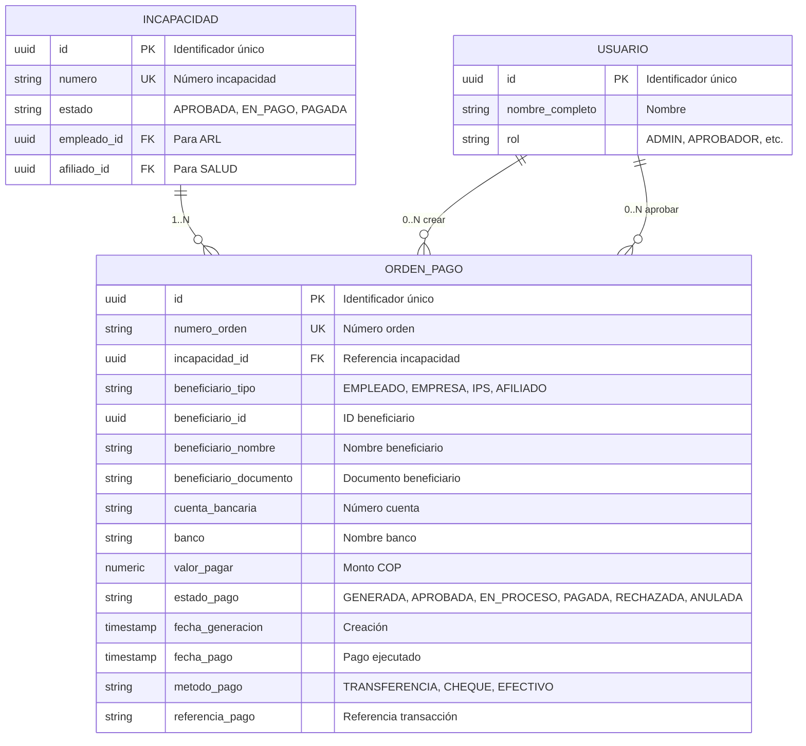

# Relaciones de Entidades - Diagramas ER

**Versión**: 2.0  
**Fecha**: Junio 2026  
**Formato**: Mermaid ER Diagrams  
**Base de Datos**: PostgreSQL 15+

---

## Tabla de Contenidos

1. [Diagrama ER Completo](#diagrama-er-completo)
2. [Subsistema ARL](#subsistema-arl)
3. [Subsistema SALUD](#subsistema-salud)
4. [Subsistema de Auditoría](#subsistema-de-auditoría)
5. [Flujos de Relaciones Clave](#flujos-de-relaciones-clave)
6. [Análisis de Cardinality](#análisis-de-cardinality)

---

## Diagrama ER Completo



---

## Subsistema ARL

**Descripción**: Gestión de incapacidades laborales con siniestros



**Restricción CHECK en INCAPACIDAD (ARL)**:
```sql
CHECK (
  tipo = 'ARL' 
  AND empleado_id IS NOT NULL 
  AND empresa_id IS NOT NULL 
  AND afiliado_id IS NULL
)
```

---

## Subsistema SALUD

**Descripción**: Gestión de incapacidades de pólizas de salud



**Restricción CHECK en INCAPACIDAD (SALUD)**:
```sql
CHECK (
  tipo = 'SALUD' 
  AND afiliado_id IS NOT NULL 
  AND empleado_id IS NULL 
  AND empresa_id IS NULL
)
```

---

## Subsistema de Auditoría

**Descripción**: Registro completo de cambios de estado y acciones de usuario

```mermaid
erDiagram
    USUARIO {
        uuid id PK "Identificador único"
        string username UK "Usuario login"
        string email UK "Email"
        string nombre_completo "Nombre"
        string rol "ADMIN, AUDITOR, APROBADOR, EMPRESA, EMPLEADO, READONLY"
        string estado "ACTIVO, INACTIVO, BLOQUEADO"
    }
    
    HISTORIAL_ESTADO {
        uuid id PK "Identificador único"
        string entity_type "incapacidad, siniestro, orden_pago"
        uuid entity_id "ID entidad (polimórfico)"
        string estado_anterior "Estado previo"
        string estado_nuevo "Nuevo estado"
        text observacion "Motivo cambio"
        timestamp fecha_cambio "Fecha/hora"
        uuid cambiado_por_id FK "Usuario"
    }
    
    AUDITORIA_LOG {
        uuid id PK "Identificador único"
        uuid usuario_id FK "Usuario acción"
        string accion "CREATE, UPDATE, DELETE, LOGIN, CAMBIO_ESTADO, etc."
        string entidad "Tipo entidad afectada"
        uuid entidad_id "ID entidad"
        jsonb detalles "Info completa"
        inet ip_address "IP cliente"
        text user_agent "Navegador"
        string request_id "ID solicitud"
        timestamp created_at "Fecha/hora"
    }
    
    AUDITORIA_DATOS_APROBADOS {
        uuid id PK "Identificador único"
        uuid incapacidad_id FK UK "Referencia incapacidad"
        jsonb datos_capturados "Snapshot completo"
        uuid aprobado_por_id FK "Usuario aprobación"
        timestamp fecha_aprobacion "Fecha/hora"
        text observacion "Notas aprobador"
    }
    
    USUARIO ||--o{ HISTORIAL_ESTADO : "0..N"
    USUARIO ||--o{ AUDITORIA_LOG : "1..N"
    USUARIO ||--o{ AUDITORIA_DATOS_APROBADOS : "0..N"
```

---

## Subsistema de Documentos

**Descripción**: Gestión de archivos adjuntos y pre-radicaciones



**Flujo de Procesamiento de Pre-Radicación**:
```
PRE_INCAPACIDAD (PENDIENTE) + PRE_DOCUMENTO
    ↓ Job Programado (validación)
    ├→ INCAPACIDAD (RADICADA) + DOCUMENTO
    │   estado PRE_INCAPACIDAD = PROCESADA
    │
    ├→ estado PRE_INCAPACIDAD = RECHAZADA (error de negocio)
    │
    └→ estado PRE_INCAPACIDAD = ERROR (excepción técnica)
```

---

## Subsistema de Pagos

**Descripción**: Gestión de órdenes de pago



**Máquina de Estados ORDEN_PAGO**:
```
GENERADA (creada automáticamente al aprobar INCAPACIDAD)
    ↓ APROBADOR revisa
    ├→ APROBADA (aprobada para pago)
    │   ↓ Sistema pagos procesa
    │   ├→ PAGADA (éxito)
    │   └→ ANULADA (error en transacción)
    │
    ├→ RECHAZADA (APROBADOR rechaza)
    │
    └→ ANULADA (ADMIN cancela)
```

---

## Flujos de Relaciones Clave

### Flujo 1: Radicación ARL

```
1. SOLICITANTE radica incapacidad
   ↓
2. PRE_INCAPACIDAD + PRE_DOCUMENTO (datos planos)
   ↓
3. Job Programado: validación y procesamiento
   ↓
4. INCAPACIDAD (RADICADA) + DOCUMENTO + HISTORIAL_ESTADO
   ↓
5. AUDITORIA_LOG registra: CREATE incapacidad
```

### Flujo 2: Auditoría de Incapacidad

```
1. INCAPACIDAD en estado RADICADA
   ↓
2. AUDITOR revisa DOCUMENTO y datos
   ↓
3. AUDITOR decide: APROBADA, OBSERVADA o RECHAZADA
   ↓
4. HISTORIAL_ESTADO: RADICADA → EN_AUDITORIA → APROBADA
   ↓
5. AUDITORIA_LOG registra: CAMBIO_ESTADO
   ↓
6. Si APROBADA:
   AUDITORIA_DATOS_APROBADOS captura snapshot
```

### Flujo 3: Aprobación y Generación de Orden de Pago

```
1. INCAPACIDAD en estado APROBADA
   ↓
2. ADMIN genera ORDEN_PAGO (GENERADA)
   ↓
3. HISTORIAL_ESTADO: APROBADA → EN_PAGO
   ↓
4. APROBADOR revisa ORDEN_PAGO
   ↓
5. ORDEN_PAGO: GENERADA → APROBADA
   ↓
6. Sistema de pagos procesa
   ↓
7. ORDEN_PAGO: APROBADA → EN_PROCESO → PAGADA
   ↓
8. INCAPACIDAD: EN_PAGO → PAGADA
   ↓
9. HISTORIAL_ESTADO + AUDITORIA_LOG registran transiciones
```

### Flujo 4: Siniestro Laboral

```
1. Accidente laboral ocurre
   ↓
2. Se reporta SINIESTRO (REPORTADO)
   ↓
3. EMPLEADO + EMPRESA asociadas
   ↓
4. Se radica INCAPACIDAD vinculada a SINIESTRO
   ↓
5. HISTORIAL_ESTADO: REPORTADO → EN_INVESTIGACION → CERRADO
   ↓
6. Múltiples INCAPACIDAD pueden vincularse a un SINIESTRO
```

---

## Análisis de Cardinality

### Relaciones 1:N

| De | A | Card | Descripción |
|----|---|------|------------|
| USUARIO | EMPLEADO | 0..1 | Un usuario puede ser empleado (opcional) |
| USUARIO | EMPRESA | 0..1 | Un usuario puede pertenecer a empresa |
| USUARIO | REFRESH_TOKEN | 1..N | Un usuario tiene N tokens de renovación |
| USUARIO | AUDITORIA_LOG | 1..N | Un usuario realiza N acciones auditadas |
| USUARIO | HISTORIAL_ESTADO | 0..N | Un usuario puede cambiar N estados |
| USUARIO | DOCUMENTO | 0..N | Un usuario sube N documentos |
| USUARIO | INCAPACIDAD | 0..N | Un usuario radica/audita/aprueba N incapacidades |
| USUARIO | ORDEN_PAGO | 0..N | Un usuario crea/aprueba N órdenes |
| EMPRESA | EMPLEADO | 1..N | Una empresa tiene N empleados |
| EMPRESA | USUARIO | 1..N | Una empresa tiene N usuarios |
| EMPRESA | INCAPACIDAD | 0..N | Una empresa tiene N incapacidades (ARL) |
| EMPRESA | SINIESTRO | 1..N | Una empresa reporta N siniestros |
| EMPLEADO | INCAPACIDAD | 1..N | Un empleado tiene N incapacidades |
| EMPLEADO | SINIESTRO | 1..N | Un empleado sufre N siniestros |
| EMPLEADO | USUARIO | 0..1 | Un empleado puede tener usuario |
| AFILIADO | INCAPACIDAD | 1..N | Un afiliado tiene N incapacidades (SALUD) |
| SOLICITANTE | INCAPACIDAD | 1..N | Un solicitante radica N incapacidades |
| SINIESTRO | INCAPACIDAD | 1..N | Un siniestro genera N incapacidades |
| INCAPACIDAD | DOCUMENTO | 1..N | Una incapacidad tiene N documentos |
| INCAPACIDAD | ORDEN_PAGO | 1..N | Una incapacidad genera N órdenes de pago |
| INCAPACIDAD | HISTORIAL_ESTADO | 1..N | Una incapacidad tiene N cambios de estado |
| INCAPACIDAD | AUDITORIA_DATOS_APROBADOS | 0..1 | Una incapacidad tiene 0 o 1 snapshot aprobado |
| PRE_INCAPACIDAD | PRE_DOCUMENTO | 1..N | Una pre-radicación tiene N documentos |

### Relaciones M:M (Indirectas)

No hay relaciones M:M directas. Las relaciones complejas se resuelven através de:

- **INCAPACIDAD**: Puede referirse a EMPLEADO (ARL) o AFILIADO (SALUD)
- **HISTORIAL_ESTADO**: Polimórfico (entity_type + entity_id)
- **ORDEN_PAGO**: Beneficiario polimórfico (beneficiario_tipo + beneficiario_id)
- **DOCUMENTO**: Relacionado a INCAPACIDAD o PRE_INCAPACIDAD

---

## Restricciones de Integridad Referencial

### Cascadas

```sql
-- Empleado → Incapacidad (no cascada, es datos importantes)
ALTER TABLE incapacidad ADD CONSTRAINT fk_incapacidad_empleado 
FOREIGN KEY (empleado_id) REFERENCES empleado(id) ON DELETE RESTRICT;

-- Empresa → Empleado (cascada, datos de negocio)
ALTER TABLE empleado ADD CONSTRAINT fk_empleado_empresa 
FOREIGN KEY (empresa_id) REFERENCES empresa(id) ON DELETE CASCADE;

-- Incapacidad → Documento (cascada, datos secundarios)
ALTER TABLE documento ADD CONSTRAINT fk_documento_incapacidad 
FOREIGN KEY (incapacidad_id) REFERENCES incapacidad(id) ON DELETE CASCADE;

-- Pre_Incapacidad → Pre_Documento (cascada)
ALTER TABLE pre_documento ADD CONSTRAINT fk_pre_documento_pre_incapacidad 
FOREIGN KEY (pre_incapacidad_id) REFERENCES pre_incapacidad(id) ON DELETE CASCADE;
```

---

## Índices de Performance

### Índices Críticos

```sql
-- Búsquedas por usuario
CREATE INDEX ix_usuario_username ON usuario(username);
CREATE INDEX ix_usuario_email ON usuario(email);

-- Búsquedas por empresa
CREATE INDEX ix_empresa_nit ON empresa(nit);
CREATE INDEX ix_empleado_empresa_id ON empleado(empresa_id);

-- Búsquedas por incapacidad
CREATE INDEX ix_incapacidad_numero ON incapacidad(numero);
CREATE INDEX ix_incapacidad_estado ON incapacidad(estado);
CREATE INDEX ix_incapacidad_empleado_id ON incapacidad(empleado_id);
CREATE INDEX ix_incapacidad_afiliado_id ON incapacidad(afiliado_id);

-- Búsquedas historial
CREATE INDEX ix_historial_entity ON historial_estado(entity_type, entity_id);
CREATE INDEX ix_historial_fecha ON historial_estado(fecha_cambio);

-- Búsquedas de auditoría
CREATE INDEX ix_auditoria_created_at ON auditoria_log(created_at);
CREATE INDEX ix_auditoria_usuario_id ON auditoria_log(usuario_id);
```

---

## Notas de Diseño

1. **Polimorfismo**:
   - HISTORIAL_ESTADO soporta múltiples tipos de entidades (entity_type + entity_id)
   - ORDEN_PAGO soporta múltiples beneficiarios (beneficiario_tipo + beneficiario_id)
   - INCAPACIDAD es polimórfica a nivel de negocio (ARL vs SALUD)

2. **Validación**:
   - CHECK constraints aseguran que INCAPACIDAD ARL/SALUD sean exclusivas
   - Restricciones de integridad FK protegen la consistencia

3. **Escalabilidad**:
   - PRE_INCAPACIDAD desacopla radicaciones del procesamiento
   - Permite procesamiento batch sin bloquear radicaciones nuevas
   - Histórico completo en HISTORIAL_ESTADO y AUDITORIA_LOG

4. **Seguridad**:
   - AUDITORIA_LOG registra IP, User-Agent, request_id
   - AUDITORIA_DATOS_APROBADOS captura snapshot inmutable
   - HISTORIAL_ESTADO inmutable (no se actualiza, solo se crea)

---

*Diagramas y relaciones sincronizados con `apps/backend/app/models/`*
